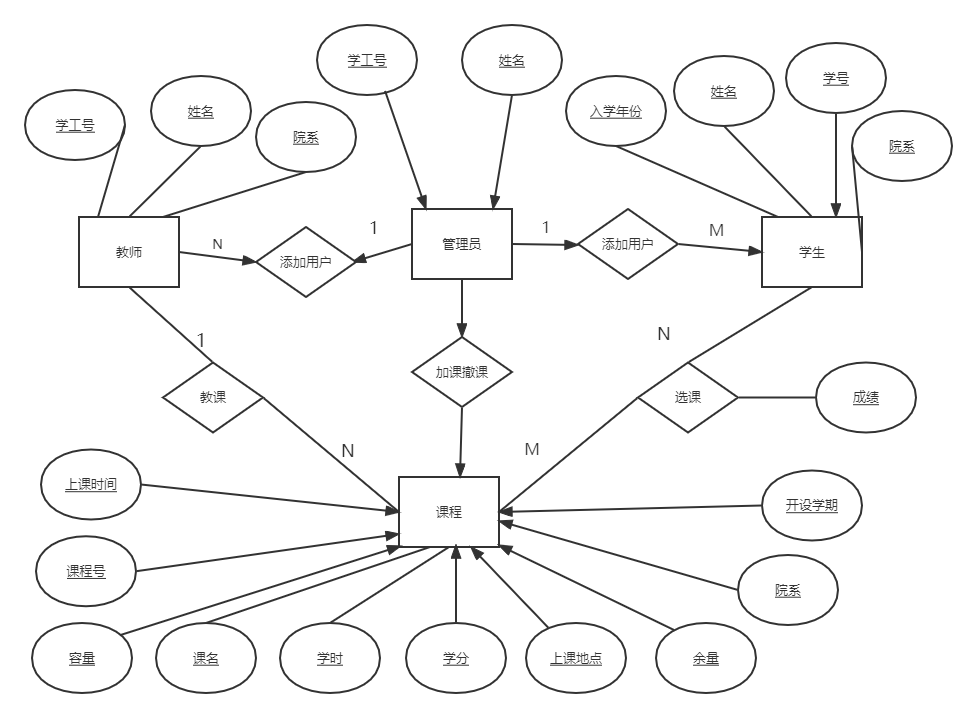
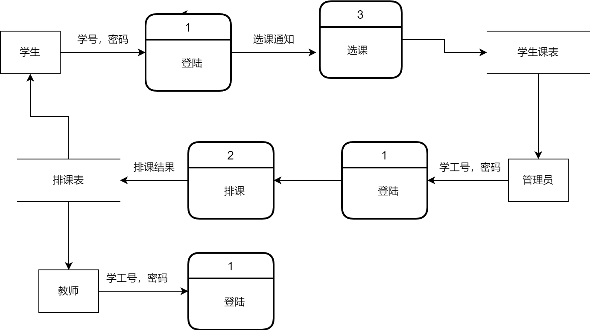
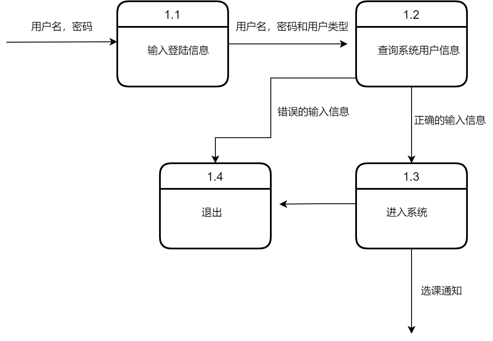
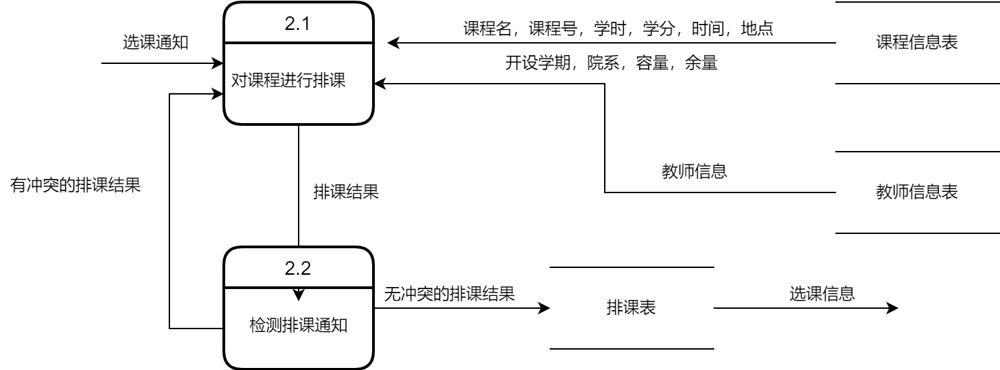
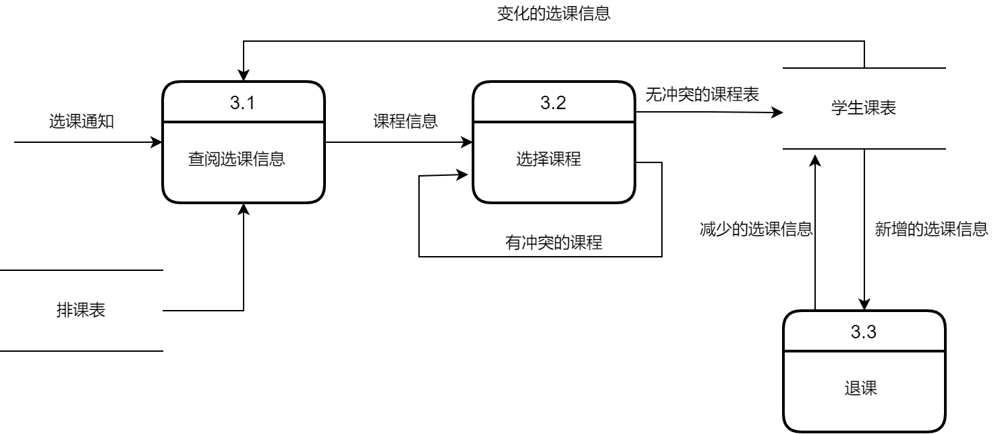

# 需求分析
## 1. 利益相关者
开发者：软工team

客户：TSN

使用者：学生，教师和管理员

***

## 2. 编写目的
本项目为学生选课系统，是一个为方便学生选择课程的服务平台，本文档的目的是为了解决系统开发的需求分析。

***

## 3. 用户需求

系统用户由教师，学生以及管理员三类组成。

- 学生
   + 进行选课和撤课操作，选课考虑分时间段选择。
   + 查询当前学期的所有课程，显示课程的信息，包括课时，学分，课名，课程号，上课时间和地点，授课老师，开设学期，余量，容量，院系。
   + 根据院系，授课老师和课程号查询某一门课。
   + 查询个人信息，包括姓名，学号，院系，入学年份。
   + 修改密码。
   + 查询所有课的成绩，包括总评。
   + 总成绩的查询。

- 教师
   + 查询个人信息，包括学工号，姓名，院系。
   + 查询所授的课程。
   + 修改密码。
   + 查询某一开设的课的具体信息，包括选修这门课的学生信息和课程信息。
   + 登记学生成绩。

- 管理员
   + 开设课程，指派课程信息。
   + 查询个人信息，包括姓名，学工号。
   + 查询和修改老师和学生的个人信息。
   + 修改密码。
   + 强制加课和撤课，指定学生信息和课程信息。
   + 增加学生用户和老师用户。
   + 查询所有课程。

***

## 4. 系统需求
   - 功能需求
        + 维护学生的个人基本信息，实现对学生个人信息的增、删、改、查，包括学生的姓名，学号，院系，入学年份。
        + 维护教师的个人基本信息，实现对教师个人信息的增、删、改、查，包括教师的学工号，姓名，院系。
        + 维护管理员的个人基本信息，实现对管理员个人信息的增、删、改、查，包括管理员的学工号，姓名。
        + 实现登陆子系统，根据管理员，学生，教师这三者不同的身份，给出不同的权限，在系统中根据身份判断其相应具有的权限，进行不同的操作。
        + 实现排课子系统，能够根据时间段进行排课，并检测课程是否冲突。
        + 实现选课子系统，包括课程浏览查询，选课和退选课程。
  - 性能需求 
      + 该系统应具有较高的并发量和数据吞吐量，以便让更多的学生更加顺畅的登陆系统进行操作。
      + 在系统上操作时，系统的响应时间应尽量短，反应的时间应当在2秒以内，以便于有一个更舒适的体验。
      + 该系统应具有良好的运行效率，以便于让学生有一个更好的体验。
  - 可靠性需求
    + 该系统应该具有良好的安全性，可靠性和可维护性，能够长时间无故障运行。
  - 开发性需求
    + 系统应具有相当的灵活性和稳定性，能够很好的适应信息管理的多边形。
  - 可扩展性需求
    + 系统设计应体现扩展性要求，可以加入其他系统的应用。 

***

## 5. 数据库ER图

***

## 6. 数据流图

1. 顶层数据流图
   
2. 1层数据流图
   
3. 2层数据流图
   
4. 3层数据流图
   
