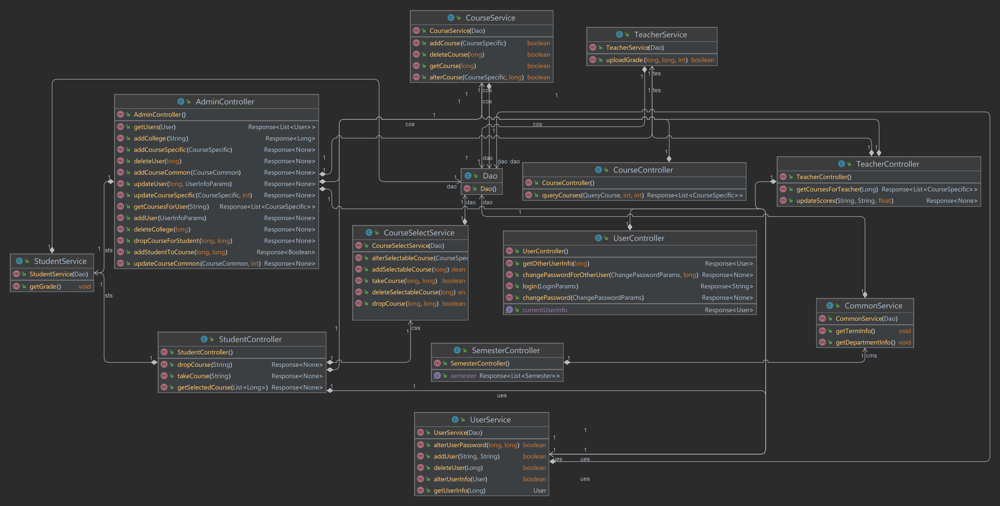
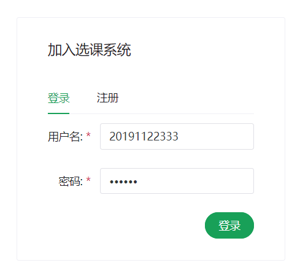
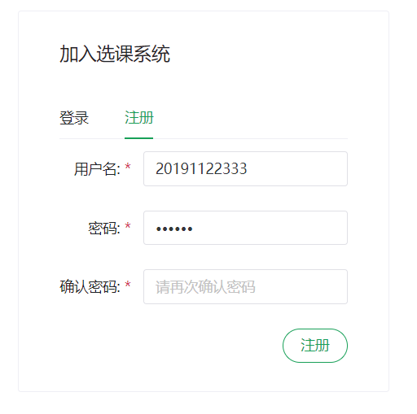
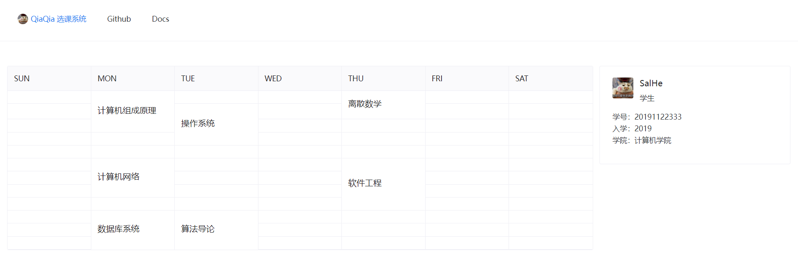

# 详细设计
## 引言
### 编写目的
该文档在软件计划文档的基础上，进一步的细化系统结构，展示了软件结构的功能与流程逻辑、程序系统结构及接口设计，详细的介绍了系统各个模块是如何实现的，包括涉及到的算法，逻辑流程等，以便用户和项目开发人员了解产品详细的设计与实现，为开发人员提供开发参考书。以下叙述将结合文字描述、伪代码、图表等来描述NoVerification选课系统的详细设计和相关的模块描述。
本报告的预期读者包括客户，开发人员以及跟该项目相关的其他有关人员。
### 背景
1. 项目名称：NoVerification选课系统
2. 任务提出者：tsn
3. 任务开发者：软工2022 Qiaqia小队
4. 用户：各大高校的师生和管理员
5. 实施单位：软工2022 Qiaqia小队
6. 
### 关键技术
数据持久化:MySql
缓存:redis
后端框架:SpringBoot、Mybatis

### 开发环境
### 软件环境
| 表项       | 选型          | 版本     | 说明                                                                                        |
| ---------- | ------------- | -------- | ------------------------------------------------------------------------------------------- |
| 操作系统   | Ubuntu(Linux) | 20.04LTS | 您也可选Windows 10。                                                                        |
| 数据库平台 | PostgreSQL    | 14.2     | 为后端服务提供关系型数据库支持。                                                            |
| 应用平台   | Java          | JDK11    | 后端服务采用Java语言编写，并采用JDK11作为开发套件，所以可能需要最低版本为11的Java运行环境。 |
| Web容器    | Nginx         | 1.21.6   | 作为承载Web静态资源的容器，同时支持反向代理将API调用代理到后端服务上。                      |

您也可以在一台性能较好的服务器上安装`Docker`与`Docker Compose`，使用我们提供的`docker compose`配置，在`Docker`中运行本系统，无需考虑环境配置。

### 硬件环境

| 服务器       | 推荐配置                                 |
| ------------ | ---------------------------------------- |
| 应用服务器   | CPU核心数：2；内存：8GB                  |
| 数据库服务器 | CPU核心数：2；内存：4GB；数据容量：500GB |

### 参考资料

1. 软工2022 Qiaqia小队NoVerification选课系统软件计划文档
2. 软工2022 Qiaqia小队NoVerification选课系统设计文档
3. 软工2022 Qiaqia小队NoVerification选课系统需求文档
4. 窦万峰.软件工程方法与实践(第三版).北京：机械工业出版社，2016
5. 普莱斯曼.软件工程：实践者的研究方法(原书第8版).北京：机械工业出版社，2016
## 程序系统结构
### 架构描述
系统总体上采用三层MVC架构，其中水平层次上自上而下分为前端界面view层、Controller控制层、Service业务逻辑兼model层，底层为用于数据库访问的Dao。垂直层次主要依据面向用户权限划分为四个切面:StudentController为代表的学生服务切面、TeacherController为代表的教师服务切面、AdminController为代表的管理员服务切面，CommonController为代表的公用服务切面。对应个个Controller于Service层划分了如下公用构件StudentService(用于学生特有业务处理构件)、CourseSelectService(单独将选课相关业务抽离出来有利于优化和非功能性需求的满足)、CourseService(用于课程特有业务处理构件，间接控制关系较为密切的CourseSelectService)、UserService(用于用户管理特有业务处理构件)、TeacherService(用于教师特有业务处理构件)，CommonService(用于公用业务业务处理构件)

| class | 描述 |
| ----- | ---- |

### 功能与流程逻辑(LZL根据前端大概描述下)

下面分用户角色简要说明一下前端需要考虑的页面及大致的逻辑、细节。

此外，用户访问需要用户权限的页面之前均需要先登录，否则无法访问。

当用户未登录时访问其他页面，会被自动导航到登录页面提示用户登录，待登录完成自动跳转至登录前的页面。

#### 用户

这些页面主要完成与所有用户都有关系的功能。

##### 登录/注册

用户可在登录页面登录或注册。目前考虑将两个功能结合到一个页面，但是放到不同的Tab里。

当用户登录成功之后，如果用户是从别的页面跳转至登录页面的，则会被导航至跳转前的页面；否则会被导航至首页。

##### 首页

用户在首页可以快速预览个人信息，以及当前学期的课程表——对于学生来说，是学生所需要上课的表；对于教师来说，是教师所教授的课程的表；对于管理员来说，此项功能暂时无用。

##### 个人信息页

用户可以在个人信息页面查看自己的个人信息，并可以对密码进行修改。

#### 学生

这些页面主要关注仅针对学生的功能。

##### 选课

学生可以在选课页面查看当前学期可以选择的课程以及它们的详细信息——比如，课程名、学分、学时、授课教师、授课时间、授课地点、容量、余量等等。并且还可以根据课程的信息来对可选课程进行条件筛选，比如查询“计算机网络”课程，查询由计算机学院开办的课程等等，这些条件可以混合查询。

##### 查询已选课程

用户可以根据自己需要查询已选的课程，这些课程可以是当前学期的，也可以是过去的学期的，同时可以查询选过的所有课程，并展示这些课程的详细信息以及获得的成绩。

##### 成绩

用户可以在成绩页面查看自己的成绩，并可以计算GPA。

#### 教师

这些页面主要关注与教师相关的功能。

###### 所授课程

教师可以在所授课程页面查看自己所授课程的详细信息，包括课程名、学分、学时、授课教师、授课时间、授课地点、容量、余量等等。

此外，教师还可以：

- 详细查看该课程包含的所有学生的信息，包括学号、姓名、性别、年龄、学院、专业等等。
- 可以对该门课程的学生登记成绩，但是会受时间限制。

#### 管理员

##### 用户管理

管理员可以在用户管理页面对用户进行管理：

- 查询用户：可根据用户名字、学号、学院等信息筛选用户。
- 增加用户：可以增加新的用户，指定其角色以及详细信息。
- 修改用户信息：可以调整用户的部分信息，如所在学院等等。
- 删除用户：可以删除用户，但是实际上该用户只会被标记为移除状态，还是会保留其信息。

##### 学院管理

- 查询学院：可根据学院名称等信息筛选学院。
- 增加学院：可以增加新的学院。

##### 课程管理

- 查询课程：可根据课程名称、学分、学时、授课教师、授课时间、授课地点、容量、余量等信息筛选课程。
- 新增课程：可以增加新的课程，并指定其名称、开课学院、学分等信息，`课程`代表了某一门课程的公共信息。
- 新增课头：可以对已有课程增加课头，它是一门`课程`的具体实例，还包括了一些额外的信息，如开课时间、地点、所属学期、授课教师等。
- 强制选课、撤课：可以对指定课头，强制导入学生（强制选课），或强制将学生从课头移除（强制撤课）。

#### 顺序图(用HHX之前的先粘贴下)

### 后端功能接口描述
- 课头指实际开的课、课程信息指课头的共用信息

1. 选课
   1. 参数:学生id、课程id
   2. 返回值:None
   3. 类型:

2. 撤课
   1. 参数:学生id、课程
   2. 返回值:None
   3. 类型:

3. 查询课程
   1. 参数:（课程名、学期、页码、页面容量、老师名、是否有余量、院系、课程信息id）
   2. 返回值:课程数组
   3. 类型:Array[object]

4. 查询个人信息
   1. 参数:（用户id）
   2. 返回值:用户信息
   3. 类型:object

5. 修改密码
   1. 参数:新密码字符串、（用户id）
   2. 返回值:None
   3. 类型:

6. 查成绩
   1. 参数:（用户id、学期）
   2. 返回值:成绩数组
   3. 类型:Array[float]

7. 查总成绩
   1. 参数:
   2. 返回值:成绩数组
   3. 类型:Array[float]

8. 老师查询课程
   1. 参数:（学期）
   2. 返回值:课程数组
   3. 类型:Array[object]

9.  查询所授特定课程信息
    1. 参数:课程id
    2. 返回值:课程信息、学生信息
    3. 类型:object、Array[object]

10. 登成绩
    1. 参数:课程id、学生id、成绩
    2. 返回值:None
    3. 类型:
  
11. 开设课头
    1.  参数:老师id、时间、地点、课程信息id
    2.  返回值:None
    3.  类型:

12. 条件查询用户信息
    1.  参数:（入学年份、院系id、用户id、姓名、角色）
    2.  返回值:用户信息数组
    3.  类型:Array[object]

13. 修改用户信息
    1.  参数:用户id、（新姓名、新院系id）
    2.  返回值:新信息
    3.  类型:object

14. 增加用户
    1.  参数:姓名、院系id、入职/入学年份、角色
    2. 返回值:None
    3. 类型:
15. 返回院系信息
    1. 参数:
    2. 返回值：院系信息数组
    3. 类型：Array[object]
16. 返回课程信息
    1. 参数：
    2. 返回值：课程信息数组
    3. 类型：Array[object]
17. 返回学期
    1. 参数：
    2. 返回值：时间
    3. 类型: String

### 储存分配

### 1.采用的数据库

采用的数据库：MySql。

对应的版本号：8.0.28。
### 2.数据库表的设计
##### user（用户表）

|      名      |  类型   | 长度  | 是否可空 | 主键  | 默认值 | 备注  |
| :----------: | :-----: | :---: | :------: | :---: | :----: | :---: |
|   user_id    | bigint  |       |    ×     |   √   |        | 自增  |
|     name     | varchar |  32   |    ×     |       |        |       |
|     role     | tinyint |       |    ×     |       |        |       |
|  roll_date   |  date   |       |    ×     |       |        |       |
|   password   | varchar |  255  |    ×     |       |        |       |
| institute_id |   int   |       |    ×     |       |        | 外键  |

##### course（课程表）

|      名      |  类型   | 长度  | 是否可空 | 主键  | 默认值 | 备注  |
| :----------: | :-----: | :---: | :------: | :---: | :----: | :---: |
|  course_id   | bigint  |       |    ×     |   √   |        | 自增  |
| course_name  | varchar |  255  |    ×     |       |        |       |
| course_hour  |   int   |       |    ×     |       |        |       |
|    credit    |  float  |       |    ×     |       |        |       |
| institute_id |   int   |       |    ×     |       |        | 外键  |

##### institute（院系表）

|       名       |  类型   | 长度  | 是否可空 | 主键  | 默认值 | 备注  |
| :------------: | :-----: | :---: | :------: | :---: | :----: | :---: |
|  institute_id  |   int   |       |    ×     |   √   |        | 自增  |
| institute_name | varchar |  255  |    ×     |       |        |       |

##### course_head（课头表）

|      名      |  类型   | 长度  | 是否可空 | 主键  | 默认值 | 备注  |
| :----------: | :-----: | :---: | :------: | :---: | :----: | :---: |
|   head_id    | bigint  |       |    ×     |   √   |        | 自增  |
|  head_name   | varchar |  255  |    ×     |       |        |       |
|  teacher_id  | bigint  |       |    ×     |       |        | 外键  |
| head_address | varchar |  255  |    ×     |       |        |       |
|  course_id   | bigint  |       |    ×     |       |        | 外键  |
|  head_year   |   int   |       |    ×     |       |        |       |
|    volume    |   int   |       |    ×     |       |        |       |
| volume_left  |   int   |       |    ×     |       |        |       |
|  head_term   | tinyint |       |    ×     |       |        |       |

##### course_user_rel（课程学生联系表）

|     名     |  类型   | 长度  | 是否可空 | 主键  | 默认值 | 备注  |
| :--------: | :-----: | :---: | :------: | :---: | :----: | :---: |
|  head_id   | bigint  |       |    ×     |   √   |        | 自增  |
| student_id | bigint  |       |    ×     |       |        | 外键  |
|   grade    |  float  |       |    ×     |       |        |       |
|   state    | tinyint |       |    ×     |       |   1    |       |

