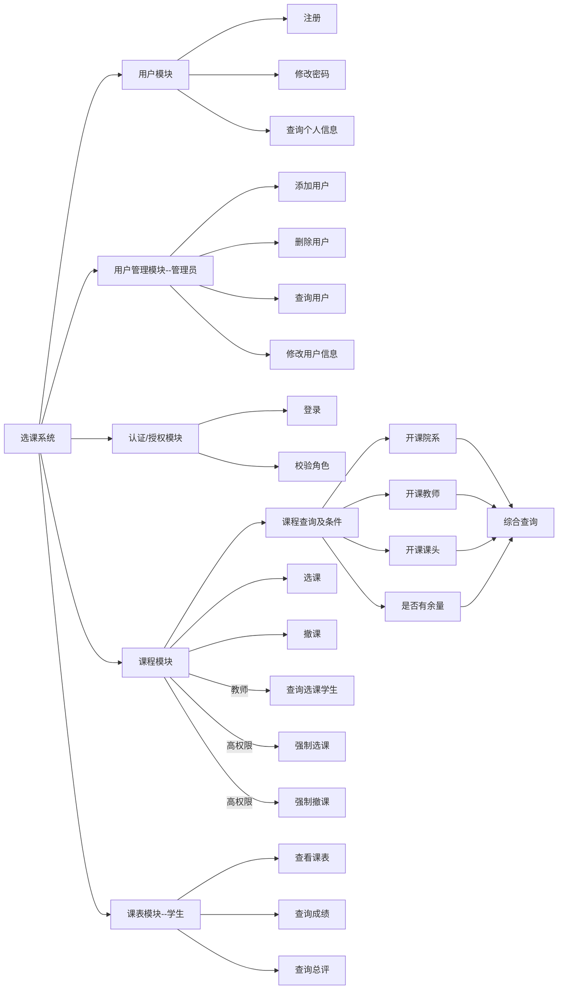
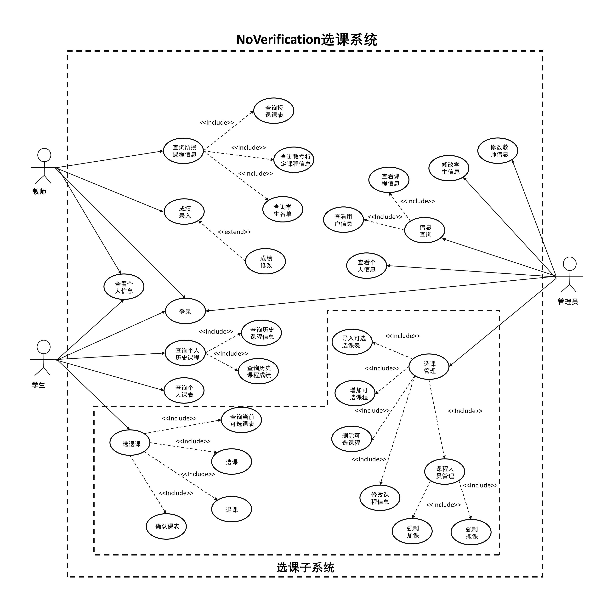

# 需求分析

## 1. 利益相关者

- 开发者：软工team——Qiaqia队
- 客户：TSN
- 用户：学生，教师和管理员

## 2. 编写目的

本项目为学生选课系统，是一个为方便学生选择课程的服务平台，本文档的目的是为了解决系统开发的需求分析。

## 3. 用户需求

系统用户由教师，学生以及管理员三类组成。

- 学生
  + 进行选课和撤课操作，选课考虑分时间段选择。
  + 查询当前学期的所有课程，显示课程的信息，包括课时，学分，课名，课程号，上课时间和地点，授课老师，开设学期，余量，容量，院系。
  + 根据院系，授课老师和课程号查询某一门课。
  + 查询个人信息，包括姓名，学号，院系，入学年份。
  + 修改密码。
  + 查询所有课的成绩，包括总评。
  + 总成绩的查询。

- 教师
  + 查询个人信息，包括学工号，姓名，院系。
  + 查询所授的课程。
  + 修改密码。
  + 查询某一开设的课的具体信息，包括选修这门课的学生信息和课程信息。
  + 登记学生成绩。

- 管理员
  + 开设课程，指派课程信息。
  + 查询个人信息，包括姓名，学工号。
  + 查询和修改老师和学生的个人信息。
  + 修改密码。
  + 强制加课和撤课，指定学生信息和课程信息。
  + 增加学生用户和老师用户。
  + 查询所有课程。

## 4. 系统需求
- 功能需求
  + 维护学生的个人基本信息，实现对学生个人信息的增、删、改、查，包括学生的姓名，学号，院系，入学年份。
  + 维护教师的个人基本信息，实现对教师个人信息的增、删、改、查，包括教师的学工号，姓名，院系。
  + 维护管理员的个人基本信息，实现对管理员个人信息的增、删、改、查，包括管理员的学工号，姓名。
  + 实现登陆子系统，根据管理员，学生，教师这三者不同的身份，给出不同的权限，在系统中根据身份判断其相应具有的权限，进行不同的操作。
  + 实现排课子系统，能够根据时间段进行排课，并检测课程是否冲突。
  + 实现选课子系统，包括课程浏览查询，选课和退选课程。
- 性能需求 
  + 该系统应具有较高的并发量和数据吞吐量，以便让更多的学生更加顺畅的登陆系统进行操作。
  + 在系统上操作时，系统的响应时间应尽量短，反应的时间应当在2秒以内，以便于有一个更舒适的体验。
  + 该系统应具有良好的运行效率，以便于让学生有一个更好的体验。
- 可靠性需求
  + 该系统应该具有良好的安全性，可靠性和可维护性，能够长时间无故障运行。
- 开发性需求
  + 系统应具有相当的灵活性和稳定性，能够很好的适应信息管理的多边形。
- 可扩展性需求
  + 系统设计应体现扩展性要求，可以加入其他系统的应用。 
  
## 5. 数据库ER图

## 6. 数据流图

1. 顶层数据流图
   
2. 1层数据流图
   
3. 2层数据流图
   
4. 3层数据流图
   

# 需求分析 —— LZL部分

## 需求概述

### 运行环境

本系统需要运行在Linux(Ubuntu)系统下，并且需要安装以下软件：JDK11、PostgreSQL、Nginx等。

## 运行环境

### 软件环境

|            | 名称          | 版本     | 概述                                                                                        |
| ---------- | ------------- | -------- | ------------------------------------------------------------------------------------------- |
| 操作系统   | Ubuntu(Linux) | 20.04LTS | 您也可选Windows 10。                                                                        |
| 数据库平台 | PostgreSQL    | 14.2     | 为后端服务提供关系型数据库支持。                                                            |
| 应用平台   | Java          | JDK11    | 后端服务采用Java语言编写，并采用JDK11作为开发套件，所以可能需要最低版本为11的Java运行环境。 |
| Web容器    | Nginx         | 1.21.6   | 作为承载Web静态资源的容器，同时支持反向代理将API调用代理到后端服务上。                      |

您也可以在一台性能较好的服务器上安装`Docker`与`Docker Compose`，使用我们提供的`docker compose`配置，在`Docker`中运行本系统，无需考虑环境配置。

### 硬件环境

| 服务器       | 推荐配置                                 |
| ------------ | ---------------------------------------- |
| 应用服务器   | CPU核心数：2；内存：8GB                  |
| 数据库服务器 | CPU核心数：2；内存：4GB；数据容量：500GB |

## 需求规定

### 软件总体功能分析

本系统主要满足学生选撤课、教师调整课程等功能，需要满足以下要求：

- 管理用户的登录、注册、个人信息等。
- 可鉴别用户身份，区分用户角色，以便确定用户可进行的操作。比如学生是不可以进行开课操作的。
- 存储用户信息、课程信息、学期信息、学院信息等等。
- 根据用户角色的不同，可以完成选课、撤课、开课、强制选撤课、查看课程信息等功能。
- 可以完成复杂的课程查询，比如按学院查询、按教师查询，多个条件组合查询等。
- 学生可以查询自己已选课表、课程成绩等。

### 功能需求

#### 用例图、子用例图及其描述

  

  - 修改教师信息
    项目|内容描述|
    |----|----|
    |用例名|修改教师信息|
    |描述|管理员对教师信息进行修改，包含增删改查|
    |参与者|管理员|
    |包含|None|
    |扩展|None|
    |泛化|None|
    |前置条件|None|
    |细节|基本流:1.获取教师信息 2.依据获取的信息增加教师、删除教师、修改教师信息。可选流:批量导入教师信息|
    |后置条件|教师信息列表发生改变|
    |例外|修改对象不存在|
    |限制|None|
    |注释|None|

  - 修改学生信息
    项目|内容描述|
    |----|----|
    |用例名|修改学生信息|
    |描述|管理员对学生信息进行修改，包含增删改查|
    |参与者|管理员|
    |包含|None|
    |扩展|None|
    |泛化|None|
    |前置条件|None|
    |细节|基本流:1.获取学生信息 2. 依据获取的信息增加学生、删除学生、修改学生信息。可选流:批量导入学生信息|
    |后置条件|学生信息列表发生改变|
    |例外|修改对象不存在|
    |限制|None|
    |注释|None|

  - 信息查询
    项目|内容描述|
    |----|----|
    |用例名|信息查询|
    |描述|管理员获取当前系统存有的课程和用户信息|
    |参与者|管理员|
    |包含|查询课程信息、查询用户信息|
    |扩展|None|
    |泛化|None|
    |前置条件|None|
    |细节|基本流:查询课程表，特定课程信息；用户表，特定用户信息。可选流:None|
    |后置条件|None|
    |例外|查询对象不存在|
    |限制|None|
    |注释|None|

  - 查询课程信息
    项目|内容描述|
    |----|----|
    |用例名|查询课程信息|
    |描述|管理员获取当前系统存有的课程信息|
    |参与者|管理员|
    |包含|None|
    |扩展|None|
    |泛化|None|
    |前置条件|None|
    |细节|基本流:1.进入系统 2.筛选带查询的课程 3.查询课程表，特定课程信息。可选流:None|
    |后置条件|None|
    |例外|查询对象不存在|
    |限制|None|
    |注释|None|

  - 查询用户信息
    项目|内容描述|
    |----|----|
    |用例名|查询用户信息|
    |描述|管理员获取当前系统存有的用户信息|
    |参与者|管理员|
    |包含|None|
    |扩展|None|
    |泛化|None|
    |前置条件|None|
    |细节|基本流:1.进入系统 2.筛选带查询用户信息 3.查询用户表，特定用户信息。可选流:None|
    |后置条件|None|
    |例外|查询对象不存在|
    |限制|None|
    |注释|None|

  - 查询个人信息
    项目|内容描述|
    |----|----|
    |用例名|查询个人信息|
    |描述|管理员查询自己的信息|
    |参与者|管理员|
    |包含|None|
    |扩展|None|
    |泛化|None|
    |前置条件|None|
    |细节|基本流:1.进入系统 2.查询个人信息。可选流:None|
    |后置条件|None|
    |例外|修改对象不存在|
    |限制|None|
    |注释|可以不实现，若实现须实现对应修改功能|

  - 选课管理
    项目|内容描述|
    |----|----|
    |用例名|选课管理|
    |描述|管理员对选课进行管理|
    |参与者|管理员|
    |包含|导入可选课表、增加可选课程、删除可选课程，修改课程信息、课程人员管理|
    |扩展|None|
    |泛化|None|
    |前置条件|选课期间|
    |细节|基本流:1.进入系统 2.导入可选课表、增加可选课程、删除可选课程，修改课程信息、课程人员管理。可选流:None|
    |后置条件|当前可选课表和人员信息发生变化|
    |例外|修改对象不存在|
    |限制|None|
    |注释|None|

  - 导入可选课程表
    项目|内容描述|
    |----|----|
    |用例名|导入可选课程表|
    |描述|管理员批量导入可选课程信息|
    |参与者|管理员|
    |包含|None|
    |扩展|None|
    |泛化|None|
    |前置条件|选课期间|
    |细节|基本流:1.获取待导入课表文件 2.进入系统，读取文件，3. 批量导入可选课程及相关信息。可选流:None|
    |后置条件|可选课程信息更新|
    |例外|None|
    |限制|None|
    |注释|None|

  - 增加可选课程
    项目|内容描述|
    |----|----|
    |用例名|增加可选课程|
    |描述|管理员增加可选课程|
    |参与者|管理员|
    |包含|None|
    |扩展|None|
    |泛化|None|
    |前置条件|选课期间|
    |细节|基本流:1.获取增加课程信息 2.在当前可选课表中注册该信息。可选流:None|
    |后置条件|当前可选课程增加|
    |例外|修改对象不存在|
    |限制|None|
    |注释|None|

  - 删除可选课程
    项目|内容描述|
    |----|----|
    |用例名|删除可选课程|
    |描述|管理员删除可选课程|
    |参与者|管理员|
    |包含|None|
    |扩展|None|
    |泛化|None|
    |前置条件|选课期间|
    |细节|基本流:1.获取待删除的课程号 2.在当前可选课表中删除该字段。可选流:None|
    |后置条件|当前可选课程减少|
    |例外|修改对象不存在|
    |限制|None|
    |注释|None|

  - 修改课程信息
    项目|内容描述|
    |----|----|
    |用例名|修改可选课程|
    |描述|管理员修改当前可选课程|
    |参与者|管理员|
    |包含|None|
    |扩展|None|
    |泛化|None|
    |前置条件|选课期间|
    |细节|基本流:1.获取待修改的课程号以及需更新的课程信息 2.在当前可选课表中依据更新信息修改对应课程的信息。可选流:None|
    |后置条件|当前可选课程信息发生改变|
    |例外|修改对象不存在|
    |限制|None|
    |注释|None|

  - 课程人员管理
    项目|内容描述|
    |----|----|
    |用例名|修改教师信息|
    |描述|管理员对当前可选课程的容量进行管理|
    |参与者|管理员|
    |包含|强制加课、强制撤课|
    |扩展|None|
    |泛化|None|
    |前置条件|None|
    |细节|基本流:1.强制加课，强制撤课。可选流:None|
    |后置条件|课程参与人员发生变化|
    |例外|修改对象不存在|
    |限制|None|
    |注释|None|

  - 强制加课
    项目|内容描述|
    |----|----|
    |用例名|强制加课|
    |描述|管理员将某学生强制加到某课头上|
    |参与者|管理员|
    |包含|None|
    |扩展|None|
    |泛化|None|
    |前置条件|None|
    |细节|基本流:1.获取加课学生、课程信息 2.进入系统修改当前选课表强制加课。可选流:None|
    |后置条件|某课程上课学生人员增加|
    |例外|修改对象不存在|
    |限制|None|
    |注释|None|

  - 强制撤课
    项目|内容描述|
    |----|----|
    |用例名|强制撤课|
    |描述|管理员将某学生从某课头上强制移除|
    |参与者|管理员|
    |包含|None|
    |扩展|None|
    |泛化|None|
    |前置条件|None|
    |细节|基本流:1.获取待撤课学生、课程信息 2.进入系统修改当前选课表，强制撤课。可选流:None|
    |后置条件|某课程上课学生人减少|
    |例外|修改对象不存在|
    |限制|None|
    |注释|None|

#### 领域模型图（概念类图）

# 需求分析  ——HHX部分

##  顺序图（3.2.4）

1.  非管理员查询特征课程的若干信息
   
  
2.  管理员创建新账户
   

3.  学生选课
   

##  系统概述（1）
本选课系统致力于在综合性大学场景下，服务于“管理员-学生-教师”客户群体的周期性、结构性选课活动和教学管理，
满足在选课活动和日常教学中学生选课、 教务信息管理统计的功能，并且致力于优化系统在选课公正性、高密度访问
量冲击抗性、安全性方面的性能指标。

##  概述（3.2.1）
从系统功能层面来讲，本系统的主要两大功能包括教务信息管理和选课匹配需求。关于教务信息管理，学生可以查看所选
课程的相关信息（例如课程类别、学分、任课教师、授课地点等）。教师可以查看和输入所授课班级的相关信息（例如班
级学生名单、学生成绩等）。并且系统中的教务信息管理模块支持复杂条件搜索，支持例如“按课程类别搜索”、“按所选
学期搜索”、“按课程成绩搜索”等条件搜索，能够为客户群体提供满足特定条件的课程子集的特定信息搜索（“课程特征”
+“课程子信息”）。除了能够支持教务信息的直接呈现，我们也会在系统中内置相关信息统计模块帮助客户完成对于教务
信息的分析。

从客户层面来说，系统需要服务的三种角色分别为管理员、学生和教师。
  对于管理员，本系统需要满足的功能有：
  - 创建新账户、设置新账户权限和录入新账户的基本信息
  - 设置选课课程表
  - 强制撤课、强制加课

  对于学生，本系统需要满足的功能有：
  - 浏览可选课程列表、提交选课申请、知晓选课结果
  - 浏览所选课程的相关信息和统计

  对于教师，本系统需要满足的功能有：
  - 浏览所负责课程列表和具体课程信息
  - 录入所负责课程的部分信息（例如成绩）
