# 需求分析

[[toc]]

## 系统概述

从系统功能层面来讲，本系统的主要两大功能包括教务信息管理和选课匹配需求。关于教务信息管理，学生可以查看所选
课程的相关信息（例如课程类别、学分、任课教师、授课地点等）。教师可以查看和输入所授课班级的相关信息（例如班
级学生名单、学生成绩等）。并且系统中的教务信息管理模块支持复杂条件搜索，支持例如“按课程类别搜索”、“按所选
学期搜索”、“按课程成绩搜索”等条件搜索，能够为客户群体提供满足特定条件的课程子集的特定信息搜索（“课程特征”
+“课程子信息”）。除了能够支持教务信息的直接呈现，我们也会在系统中内置相关信息统计模块帮助客户完成对于教务
信息的分析。

从客户层面来说，系统需要服务的三种角色分别为管理员、学生和教师。
  对于管理员，本系统需要满足的功能有：
  - 创建新账户、设置新账户权限和录入新账户的基本信息
  - 设置选课课程表
  - 强制撤课、强制加课

  对于学生，本系统需要满足的功能有：
  - 浏览可选课程列表、提交选课申请、知晓选课结果
  - 浏览所选课程的相关信息和统计

  对于教师，本系统需要满足的功能有：
  - 浏览所负责课程列表和具体课程信息
  - 录入所负责课程的部分信息（例如成绩）

## 需求概述

### 目标

本选课系统致力于在综合性大学场景下，服务于“管理员-学生-教师”客户群体的周期性、结构性选课活动和教学管理，
满足在选课活动和日常教学中学生选课、 教务信息管理统计的功能，并且致力于优化系统在选课公正性、高密度访问
量冲击抗性、安全性方面的性能指标。

#### 开发意图

本系统旨在使学生更方便的进行课程的选择与撤销以及查看课程的信息与成绩，使老师更加方便查看所教授课程的信息和登记学生的成绩，使管理员更加方便进行开设课程以及加课和撤课。

#### 应用目标

高校学生，老师以及教秘。

#### 作用范围

高校

### 用户特点

学生：该系统主要为学生提供选课服务，因此学生可以直接查看选课情况，学生可以根据本人学号和密码登陆系统，进行选课和撤课操作，查看课程信息，查看考试成绩等。

老师：在该系统中，为方便教师工作，要求教师能够查看自己信息，查询所授课程的信息，最后登记学生的成绩。

管理员：负责整个课表的维护，包括开设课程，生成课表。所设计的信息包括课程信息，教师信息和学生信息，新增学生和老师的信息。

### 关键点

#### 关键功能

#### 关键算法

#### 关键技术

### 利益相关者

- 开发者：软工team——Qiaqia队
- 客户：TSN
- 用户：学生，教师和管理员

### 运行环境

本系统需要运行在Linux(Ubuntu)系统下，并且需要安装以下软件：JDK11、PostgreSQL、Nginx等。

## 运行环境

### 软件环境

|            | 名称          | 版本     | 概述                                                                                        |
| ---------- | ------------- | -------- | ------------------------------------------------------------------------------------------- |
| 操作系统   | Ubuntu(Linux) | 20.04LTS | 您也可选Windows 10。                                                                        |
| 数据库平台 | PostgreSQL    | 14.2     | 为后端服务提供关系型数据库支持。                                                            |
| 应用平台   | Java          | JDK11    | 后端服务采用Java语言编写，并采用JDK11作为开发套件，所以可能需要最低版本为11的Java运行环境。 |
| Web容器    | Nginx         | 1.21.6   | 作为承载Web静态资源的容器，同时支持反向代理将API调用代理到后端服务上。                      |

您也可以在一台性能较好的服务器上安装`Docker`与`Docker Compose`，使用我们提供的`docker compose`配置，在`Docker`中运行本系统，无需考虑环境配置。

### 硬件环境

| 服务器       | 推荐配置                                 |
| ------------ | ---------------------------------------- |
| 应用服务器   | CPU核心数：2；内存：8GB                  |
| 数据库服务器 | CPU核心数：2；内存：4GB；数据容量：500GB |

## 需求规定

### 软件总体功能分析

本系统主要满足学生选撤课、教师调整课程等功能，需要满足以下要求：

- 管理用户的登录、注册、个人信息等。
- 可鉴别用户身份，区分用户角色，以便确定用户可进行的操作。比如学生是不可以进行开课操作的。
- 存储用户信息、课程信息、学期信息、学院信息等等。
- 根据用户角色的不同，可以完成选课、撤课、开课、强制选撤课、查看课程信息等功能。
- 可以完成复杂的课程查询，比如按学院查询、按教师查询，多个条件组合查询等。
- 学生可以查询自己已选课表、课程成绩等。

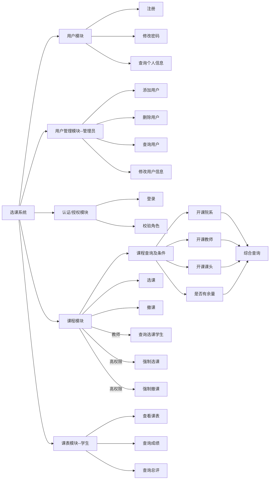

### 功能需求

#### 用户故事

##### 作为一个学生我想要进行选课

描述：作为一个学生，我想要能够查看整个课程表信息，点击具体课程能够查看具体信息，查看自己已选的课的课程表，可查看自己的信息，能够根据课程名，老师和课程号来查询课程表。

验收标准：

1. 登陆时，使用自己的学号和密码登陆。
1. 如果在选课期间，则能进入选课界面，否则弹出提示，进入选课界面，应当是整个课程列表，点击某门课程弹出的应当是课程的具体信息，在搜索框输入课程名或者老师名或者课程号能够筛选出相应 的课程。
2. 点击选课按钮，如果该课程与当前已选课程没有冲突且余量充足，则加入自己的课程表；如果有冲突或者没有余量，则应当提示。
3. 进入自己的课程表时，应当有图表示和列表表示，点击撤课按钮，能够从当前课程表剔除。
4. 进入成绩表后，能够以列表的形式表示每门课的成绩。
5. 点击自己的信息，能够查看自己的信息以及修改密码。

##### 作为一个老师，我想要查看所授课程

描述：作为一个老师，我想要查看自己所授的整个课程表以及自己的信息，可以登记学生的成绩。

验收标准：
1. 登陆时，使用自己的学工号和密码登陆。
2. 进入界面后，能够查看自己所有所授的课程的课程表，同时以图和列表表示。
3. 点击某门具体的课，能够查看课程信息，包括这门课所有的学生信息，以及该门课的课程信息。
4. 进入登记成绩界面，显示出所有所授课程，以列表形式表示，点击进入某门课，展示出整个学生列表，在每个学生后输入该学生的成绩。
5. 点击自己的信息，能够查看自己的信息以及修改密码。

##### 作为一个管理员，我想要能够管理所有学生和老师和课程。

描述：作为一个管理员，我想要开设某门课程，增加学生和老师用户，加课与撤课。

验收标准：

1. 登陆时，使用自己的学工号和密码进行登陆。
2. 能够输入学生信息增加一名新生，输入老师信息增加一名老师。
3. 能够输入课程信息开设一门新课，如果与先前的课没有冲突，则增加成功，如果有冲突，则弹出提示。
4. 能够查看所有课程的信息，包括选择这门课的所有学生信息。能够通过课程名，课程号，老师名查询课程。
5. 当选课时间结束，学生要求强制加课或撤课，能够输入学生信息和课程信息，把该名学生添加到该课程。
6. 能够查看所有学生的所有成绩，能够通过学号查询学生。
7. 能够查看所有老师的信息，通过学工号查询老师。

#### 场景描述

小明同学在早上十点到夜晚12点的选课期间，进入选课系统进行选课，他输入自己的学号和密码进行登陆。登陆之后，他点击个人信息查看自己的信息，验证信息是否有误；之后进入选课界面，他点击一门数据库课程，查看该课程的信息，该课程由赵老师教授，地点在东校区，周一11-13节，他点击了选课按钮，将该课程加入到自己的课程表；随后查看当前已选课的课程表，发现数据库课程已选上，随后他进入了成绩界面，查看自己上学期课程的成绩，确认上学期所有课程的成绩无误后，最后退出登陆。

赵老师教授了一门数据库课程。赵老师输入自己的学工号和密码进入选课系统，随后查看自己当前学期所有教授课程的课程表，确认无误后，点击课程列表的数据库课程，查看数据库课程的信息，地点在东校区，周一11-13节，随后他点击学生信息，查看所有已选该课程的学生信息，发现小明同学选了这门课。随后他点击上学期所教课程的课程表，点击数据结构课程，给小明同学登记成绩，输入了59分。随后退出登陆。

赵老师跟王教秘说想要教授一门数据库课程，并将时间，地点告知了王教秘。王教秘输入自己的学工号和密码登陆选课系统，查看自己的信息，确认无误后，他点击了开设课程按钮，随后输入了课程信息，包括授课老师为赵老师，时间为周三11-13节，地点为东校区，确认后，该课程与其他课程的时间冲突，弹出提示，随后王教秘又重新输入时间为周一11-13节，确认后；随后查看所有课程的课程列表，发现数据库课程已开设，随后退出登陆。

#### 用户需求

系统用户由教师，学生以及管理员三类组成。

- 学生
  + 进行选课和撤课操作，选课考虑分时间段选择。
  + 查询当前学期的所有课程，显示课程的信息，包括课时，学分，课名，课程号，上课时间和地点，授课老师，开设学期，余量，容量，院系。
  + 根据院系，授课老师和课程号查询某一门课。
  + 查询个人信息，包括姓名，学号，院系，入学年份。
  + 修改密码。
  + 查询所有课的成绩，包括总评。
  + 总成绩的查询。

- 教师
  + 查询个人信息，包括学工号，姓名，院系。
  + 查询所授的课程。
  + 修改密码。
  + 查询某一开设的课的具体信息，包括选修这门课的学生信息和课程信息。
  + 登记学生成绩。

- 管理员
  + 开设课程，指派课程信息。
  + 查询个人信息，包括姓名，学工号。
  + 查询和修改老师和学生的个人信息。
  + 修改密码。
  + 强制加课和撤课，指定学生信息和课程信息。
  + 增加学生用户和老师用户。
  + 查询所有课程。

#### 用例图、子用例图及其描述

  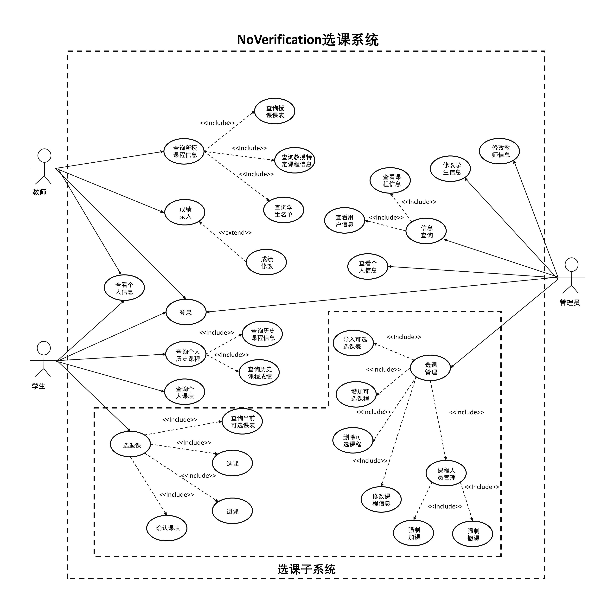

TODO 统一用例描述格式(待确定)

##### 登录系统

- 用例名称: 登录系统
- 参与者: 教师/学生/管理员等
- 简要说明: 用户在进行操作之前，需要先登录系统。
- 前置条件: 用户拥有本系统账号，可以是教师/学生/管理员等任一本系统角色。
- 基本事件流: 
  1. 用户输入账号密码，并点击登录按钮。
  2. 系统提示是否登录成功。
  3. 用例终止。
- 后置条件: 
  1. 用户成功登录，可以执行其他操作。

##### 查询所授课程信息

- 用例名称: 查询所授课程信息
- 参与者: 教师
- 简要说明: 教师可以查询自身所授课程相关信息。
- 前置条件: 用户作为教师角色登录系统。
- 基本事件流: 
  1. 教师选择查询授课课表。
  2. 教师查询所授课程学生名单。
- 后置条件: 
  1. 教师查询到相关信息，并可以查看。

##### 成绩录入

- 用例名称: 成绩录入
- 参与者: 教师
- 简要说明: 教师可以针对自己所授课程录入学生的成绩。
- 前置条件: 用户作为教师角色登录系统。
- 基本事件流: 
  1. 教师选择查询授课课表。
  2. 教师选择指定课程。
  3. 教师对课程内的学生录入成绩或修改已录入成绩。
- 后置条件: 
  1. 教师成功录入成绩，并可以查看。

##### 选撤课

- 用例名称: 选撤课
- 参与者: 学生
- 简要说明: 学生可以进行选撤课操作。
- 前置条件: 用户已登录系统，并且是学生。
- 基本事件流: 
  1. 学生选择要选/撤的课程，并确认操作。
  2. 系统确认是否可以执行相应的操作，并予以响应。
- 后置条件: 
  1. 学生成功选择/撤课。

##### 强制选撤课

- 用例名称: 强制选撤课
- 参与者: 教师等课程高权限角色
- 简要说明: 教师等课程高权限角色可以对学生的课程表进行强制选课、撤课操作。
- 前置条件: 用户已登录系统，并且是教师等课程高权限角色用户。
- 基本事件流: 
  1. 选择要操作的学生，并指定要操作的课程，选择强制选课或强制撤课。
  2. 系统确认是否可以执行相应的操作，并予以响应。
- 后置条件: 
  1. 成功为学生强制选择或强制撤课。

##### 查询历史课程信息

- 用例名称: 查询历史课程信息
- 参与者: 学生。
- 简要说明: 学生可以对自己的历史课程信息进行查询。
- 前置条件: 用户已按学生角色登录系统。
- 基本事件流: 
  1. 用户进入个人信息页，查询历史课程信息。
  2. 系统为学生展示历史课程信息。
- 后置条件: 
  1. 成功查询到结果。

##### 查询个人课表

- 用例名称: 查询个人课表
- 参与者: 学生。
- 简要说明: 学生可以查询自己已选课表、历史学期课程表。
- 前置条件: 用户已按学生角色登录系统。
- 基本事件流: 
  1. 用户进入个人信息页，查询已选课程或历史学期课程表。
  2. 系统为学生展示已选课程。
- 后置条件: 
  1. 成功查询到结果。

##### 修改教师信息

- 用例名称: 修改教师信息
- 参与者: 管理员
- 简要说明: 管理员对教师信息进行修改，包含增删改查
- 前置条件: 用户已登录系统。
- 基本事件流: 
  1. 获取教师信息。
  2. 依据获取的信息增加教师、删除教师、修改教师信息。
- 可选事件流: 
  1. 批量导入教师信息
- 例外: 
  1. 修改对象不存在
- 后置条件: 
  1. 成功修改。

##### 修改学生信息

- 用例名称: 修改学生信息
- 参与者: 管理员
- 简要说明: 管理员对学生信息进行修改，包含增删改查
- 前置条件: 用户已登录系统。
- 基本事件流: 
  1. 获取学生信息。
  2. 依据获取的信息增加学生、删除学生、修改学生信息。
- 可选事件流: 
  1. 批量导入学生信息
- 例外: 
  1. 修改对象不存在
- 后置条件: 
  1. 成功修改。

##### 信息查询
    
|项目|内容描述|
|----|----|
|用例名|信息查询|
|描述|管理员获取当前系统存有的课程和用户信息|
|参与者|管理员|
|包含|查询课程信息、查询用户信息|
|扩展|None|
|泛化|None|
|前置条件|None|
|细节|基本流:查询课程表，特定课程信息；用户表，特定用户信息。可选流:None|
|后置条件|None|
|例外|查询对象不存在|
|限制|None|
|注释|None|

##### 查询课程信息

|项目|内容描述|
|----|----|
|用例名|查询课程信息|
|描述|管理员获取当前系统存有的课程信息|
|参与者|管理员|
|包含|None|
|扩展|None|
|泛化|None|
|前置条件|None|
|细节|基本流:1.进入系统 2.筛选带查询的课程 3.查询课程表，特定课程信息。可选流:None|
|后置条件|None|
|例外|查询对象不存在|
|限制|None|
|注释|None|

##### 查询用户信息
    
|项目|内容描述|
|----|----|
|用例名|查询用户信息|
|描述|管理员获取当前系统存有的用户信息|
|参与者|管理员|
|包含|None|
|扩展|None|
|泛化|None|
|前置条件|None|
|细节|基本流:1.进入系统 2.筛选带查询用户信息 3.查询用户表，特定用户信息。可选流:None|
|后置条件|None|
|例外|查询对象不存在|
|限制|None|
|注释|None|

##### 查询个人信息
    
|项目|内容描述|
|----|----|
|用例名|查询个人信息|
|描述|管理员查询自己的信息|
|参与者|管理员|
|包含|None|
|扩展|None|
|泛化|None|
|前置条件|None|
|细节|基本流:1.进入系统 2.查询个人信息。可选流:None|
|后置条件|None|
|例外|修改对象不存在|
|限制|None|
|注释|可以不实现，若实现须实现对应修改功能|

##### 选课管理
    
|项目|内容描述|
|----|----|
|用例名|选课管理|
|描述|管理员对选课进行管理|
|参与者|管理员|
|包含|导入可选课表、增加可选课程、删除可选课程，修改课程信息、课程人员管理|
|扩展|None|
|泛化|None|
|前置条件|选课期间|
|细节|基本流:1.进入系统 2.导入可选课表、增加可选课程、删除可选课程，修改课程信息、课程人员管理。可选流:None|
|后置条件|当前可选课表和人员信息发生变化|
|例外|修改对象不存在|
|限制|None|
|注释|None|

##### 导入可选课程表
    
|项目|内容描述|
|----|----|
|用例名|导入可选课程表|
|描述|管理员批量导入可选课程信息|
|参与者|管理员|
|包含|None|
|扩展|None|
|泛化|None|
|前置条件|选课期间|
|细节|基本流:1.获取待导入课表文件 2.进入系统，读取文件，3. 批量导入可选课程及相关信息。可选流:None|
|后置条件|可选课程信息更新|
|例外|None|
|限制|None|
|注释|None|

##### 增加可选课程
    
|项目|内容描述|
|----|----|
|用例名|增加可选课程|
|描述|管理员增加可选课程|
|参与者|管理员|
|包含|None|
|扩展|None|
|泛化|None|
|前置条件|选课期间|
|细节|基本流:1.获取增加课程信息 2.在当前可选课表中注册该信息。可选流:None|
|后置条件|当前可选课程增加|
|例外|修改对象不存在|
|限制|None|
|注释|None|

##### 删除可选课程
    
|项目|内容描述|
|----|----|
|用例名|删除可选课程|
|描述|管理员删除可选课程|
|参与者|管理员|
|包含|None|
|扩展|None|
|泛化|None|
|前置条件|选课期间|
|细节|基本流:1.获取待删除的课程号 2.在当前可选课表中删除该字段。可选流:None|
|后置条件|当前可选课程减少|
|例外|修改对象不存在|
|限制|None|
|注释|None|

##### 修改课程信息
    
|项目|内容描述|
|----|----|
|用例名|修改可选课程|
|描述|管理员修改当前可选课程|
|参与者|管理员|
|包含|None|
|扩展|None|
|泛化|None|
|前置条件|选课期间|
|细节|基本流:1.获取待修改的课程号以及需更新的课程信息 2.在当前可选课表中依据更新信息修改对应课程的信息。可选流:None|
|后置条件|当前可选课程信息发生改变|
|例外|修改对象不存在|
|限制|None|
|注释|None|

##### 课程人员管理
    
|项目|内容描述|
|----|----|
|用例名|修改教师信息|
|描述|管理员对当前可选课程的容量进行管理|
|参与者|管理员|
|包含|强制加课、强制撤课|
|扩展|None|
|泛化|None|
|前置条件|None|
|细节|基本流:1.强制加课，强制撤课。可选流:None|
|后置条件|课程参与人员发生变化|
|例外|修改对象不存在|
|限制|None|
|注释|None|

##### 强制加课
    
|项目|内容描述|
|----|----|
|用例名|强制加课|
|描述|管理员将某学生强制加到某课头上|
|参与者|管理员|
|包含|None|
|扩展|None|
|泛化|None|
|前置条件|None|
|细节|基本流:1.获取加课学生、课程信息 2.进入系统修改当前选课表强制加课。可选流:None|
|后置条件|某课程上课学生人员增加|
|例外|修改对象不存在|
|限制|None|
|注释|None|

##### 强制撤课

|项目|内容描述|
|----|----|
|用例名|强制撤课|
|描述|管理员将某学生从某课头上强制移除|
|参与者|管理员|
|包含|None|
|扩展|None|
|泛化|None|
|前置条件|None|
|细节|基本流:1.获取待撤课学生、课程信息 2.进入系统修改当前选课表，强制撤课。可选流:None|
|后置条件|某课程上课学生人减少|
|例外|修改对象不存在|
|限制|None|
|注释|None|

#### 领域模型图（概念类图）

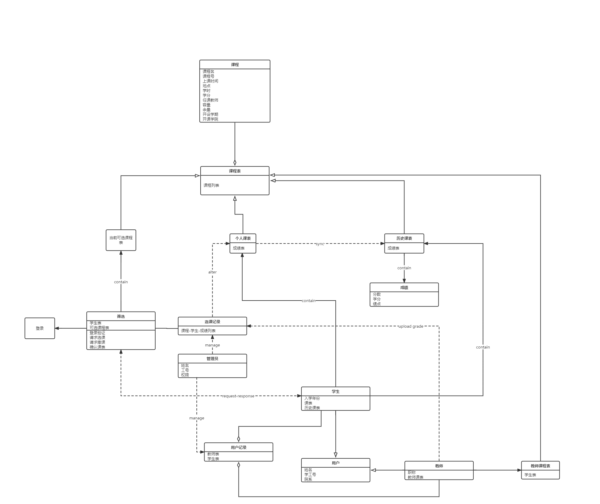

#### 顺序图

1.  非管理员查询特征课程的若干信息
   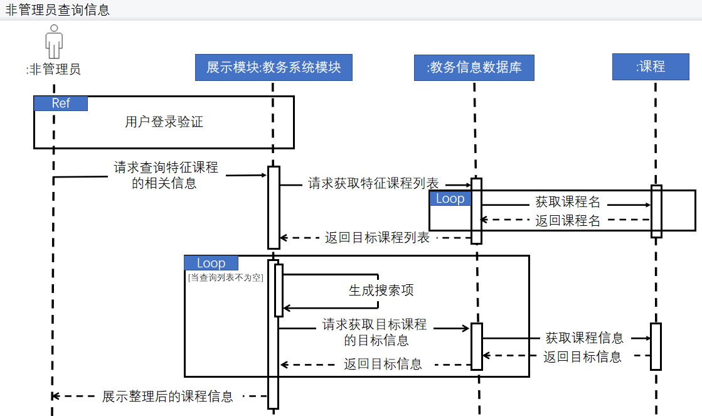
  
2.  管理员创建新账户
   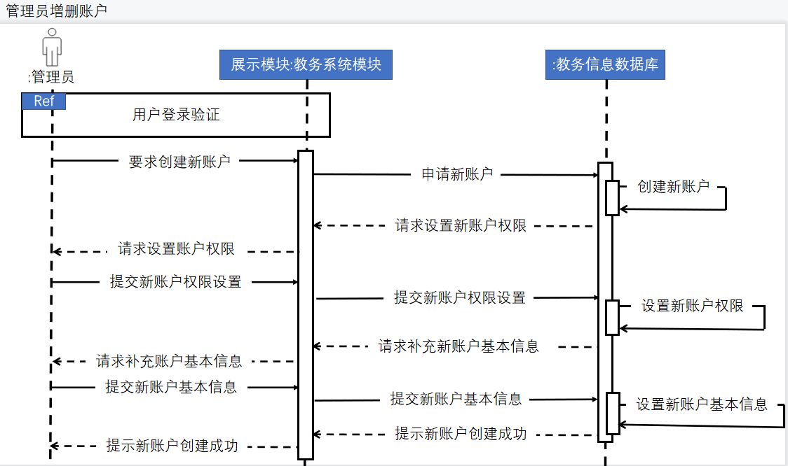

3.  学生选课
   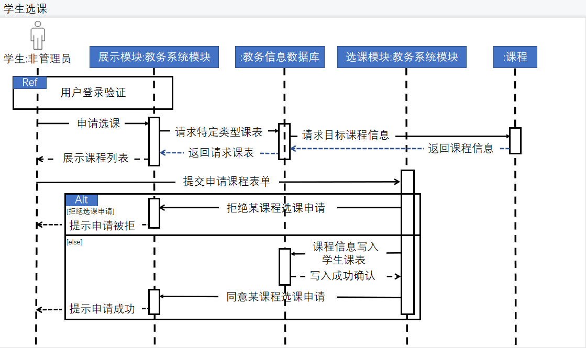

#### 数据库ER图

#### 数据流图

1. 顶层数据流图
   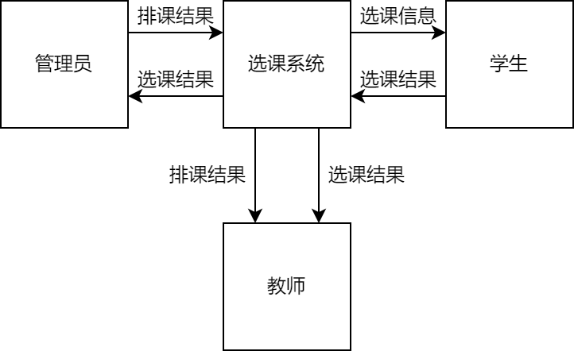
2. 1层数据流图
   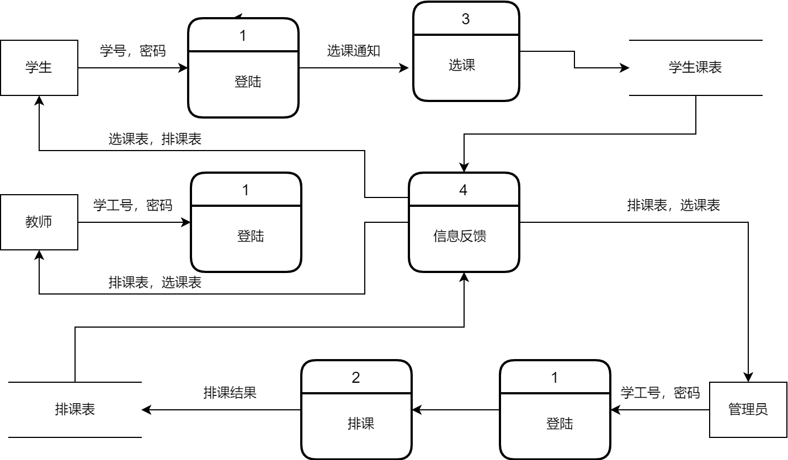
3. 2层数据流图
   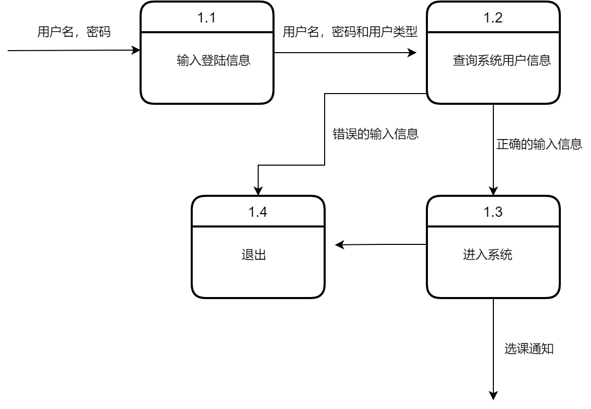
   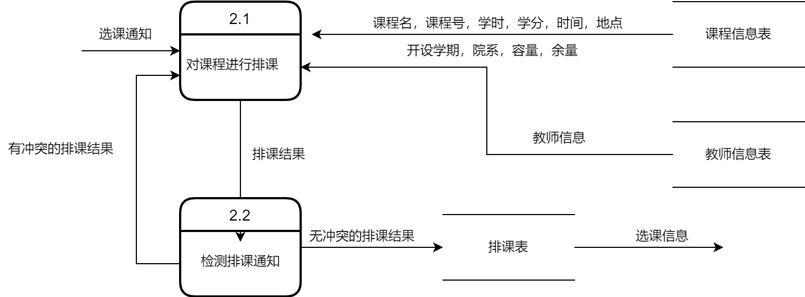
   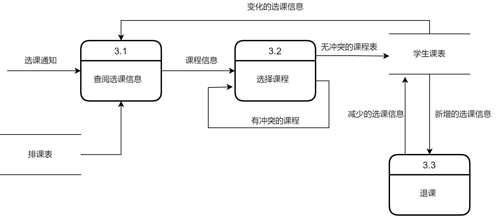

### 非功能需求

- 并发性需求
  + 优化用户场景:
  针对某个用户场景要考虑到执行相应功能时，是否可以将请求数量进行优化压缩，这考验`API`的设计是否完善全面。并且针对前端页面，要对单个页面的请求数量和数据显示数量进行慎重考虑，尽量做到数据简洁且全面，没有冗余的数据请求与数据显示。
  + 应对峰值访问:
  在峰值访问时，考虑`Cache`等解决方案。另外也需要优化数据库访问、关注`DAO`层的设计等，前端考虑数据持久化。
	同时也对硬件提出要求，考虑采用配置更好的服务器。
  + 对用户数量进行调研:
  要对用户的所有数量、平均每天访问数量、峰值用户数量、用户从登录系统到退出系统的时间间隔、被考察时间长度等进行调研与反馈。
  根据并发数公式算出相应数据后 ，针对该数据进行更充分的并发性需求讨论。
- 安全性需求
  + 身份校验和权限:
  用户在登录后根据身份不同会得到不同的权限，各个权限有用户需求确定。
  利用网页`session`存储来保存用户的权限令牌(即`token`)，或者保存一些辅助校验的键值对。在用户进行每一次请求时，要发送这些用于校验的键值对。在服务器收到请求时应根据请求头内容来选择是否同意该次请求。
  + 表单验证:
  需要对用户的输入进行合法性校验，比如密码长度、非法字符、格式冲突、数据临界值等等。前端可以选做对输入的检查，也可以将数据发送给服务器后，有服务器进行最后的、最权威的校验。前端接收到服务器的消息后，选择性进行提示或返回。
  + 防止`SQL`注入和`XSS`攻击:
  `SQL`注入随着服务器框架的完善已经被解决。在面对`XSS`攻击时，后端开发者应该遵守一个原则即不相信任何用户输入和输入来源。
  + 处理表单的二次提交:
  用户可以快速点击某些提交类组件多次，前端需要对这类情况进行处理，例如在一次提交后就对该组件进行阻塞，或者后端对多次提交进行检查与提示。
  + 文件上传:
  文件的上传需要有文件类型和大小的严格限制。
  另外，不应该上传可执行文件；需要获取文件真实的类型信息而非后缀名。
  文件上传的一个陷阱就是使用了客户端来源的文件名作为文件存储的文件名，这是极为不可靠的，在上传后的文件系统中需要使用内建的唯一命名，并通过数据库来记录用户上传的文件名。
  + 数据库加密:
  在数据库中将敏感的数据进行加密处理。例如对用户密码进行`base64`的加密。以防止数据库文件泄露，造成经济损失。
- 性能需求
  + 响应时间:
  用户进行操作或请求后，是否需要服务器返回数据。如果需要返回数据，则应设置一个请求时间的上限，假如没有该上限，可能造成用户体验不流畅。并且在超过响应时长后应进行提示。在优化响应时长方面可以考虑：优化`SQL`语句、优化静态资源的存储、同异步操作、第三方集成等。硬件配置也可以优化响应时间，在系统对此迭代后可以考虑更换服务器主机。
  + 考虑是否实现实时消息通知:
  需要消息模块的系统要考虑如何动态、实时显示消息数量。若考虑实时显示，则需要使用轮询、长连接等解决方案，此时后端开发人员需要添加更复杂的逻辑。若不考虑显示，对开发团队而言无疑减少工作量但对会削弱用户体验。
  + 分布式系统:
  考虑到本系统的用户仅为某一学校或机构的所有教职工、学生等，用户量小。故不采用分布式系统。
  + 游离数据处理:
  如果将部分删除功能授权给用户，则需要考虑是否要对被删除数据的关联数据也进行删除。
- 易用性需求
  + 加载状态的UI设计:
  加载状态是比较容易被忽视的需求，在高并发量的开发模式下，数据的获取都是异步加载，如果忽略该需求，会在网络条件较好时出现闪烁的情况，而在网络条件不好时又会看起来卡顿。
  + 输出格式化:
  在前端页面展示时，需要将从后端拉取的数据进行处理，也可以后端进行处理后再返回数据。在显示数据时，要考虑到易读、方便。例如，对数字使用千分位分隔显示；对时间进行格式化输出，可以使用`“一天前”`、`“一月前”`等人性化显示方式；图片的输出要进行裁剪与缩放等。
  + 用户返回与用户确认:
  若用户进行到某一步骤时，需要点击“确认”或“取消”，则需要考虑在点击后用户将会返回或跳转到哪一页面。是在该页进行跳转还是另开新页进行跳转。
  + 用户界面美观易用:
  在前端设计时，要参考用户量大的几个网站（例如bilibili、爱奇艺、淘宝、知乎、微博、百度等），学习并借鉴这类网站的用户操作逻辑、交互组件摆放、交互组件样式等。同时要做到美观，尽量做到色调统一、扁平化设计。
