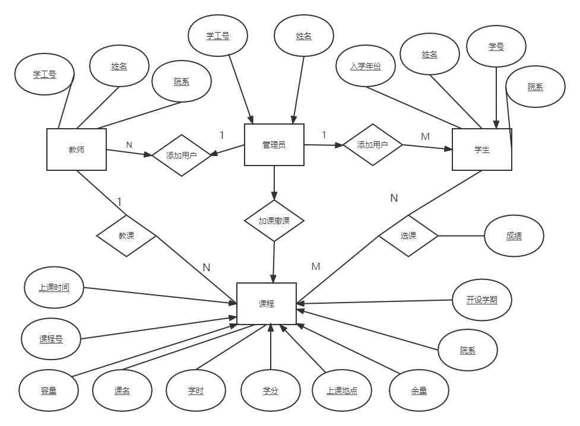

# 需求分析

## 1. 利益相关者

- 开发者：软工team——Qiaqia队
- 客户：TSN
- 用户：学生，教师和管理员

## 2. 编写目的

本项目为学生选课系统，是一个为方便学生选择课程的服务平台，本文档的目的是为了解决系统开发的需求分析。

## 3. 用户需求

系统用户由教师，学生以及管理员三类组成。

- 学生
  + 进行选课和撤课操作，选课考虑分时间段选择。
  + 查询当前学期的所有课程，显示课程的信息，包括课时，学分，课名，课程号，上课时间和地点，授课老师，开设学期，余量，容量，院系。
  + 根据院系，授课老师和课程号查询某一门课。
  + 查询个人信息，包括姓名，学号，院系，入学年份。
  + 修改密码。
  + 查询所有课的成绩，包括总评。
  + 总成绩的查询。

- 教师
  + 查询个人信息，包括学工号，姓名，院系。
  + 查询所授的课程。
  + 修改密码。
  + 查询某一开设的课的具体信息，包括选修这门课的学生信息和课程信息。
  + 登记学生成绩。

- 管理员
  + 开设课程，指派课程信息。
  + 查询个人信息，包括姓名，学工号。
  + 查询和修改老师和学生的个人信息。
  + 修改密码。
  + 强制加课和撤课，指定学生信息和课程信息。
  + 增加学生用户和老师用户。
  + 查询所有课程。

## 4. 系统需求
- 功能需求
  + 维护学生的个人基本信息，实现对学生个人信息的增、删、改、查，包括学生的姓名，学号，院系，入学年份。
  + 维护教师的个人基本信息，实现对教师个人信息的增、删、改、查，包括教师的学工号，姓名，院系。
  + 维护管理员的个人基本信息，实现对管理员个人信息的增、删、改、查，包括管理员的学工号，姓名。
  + 实现登陆子系统，根据管理员，学生，教师这三者不同的身份，给出不同的权限，在系统中根据身份判断其相应具有的权限，进行不同的操作。
  + 实现排课子系统，能够根据时间段进行排课，并检测课程是否冲突。
  + 实现选课子系统，包括课程浏览查询，选课和退选课程。
- 性能需求 
  + 该系统应具有较高的并发量和数据吞吐量，以便让更多的学生更加顺畅的登陆系统进行操作。
  + 在系统上操作时，系统的响应时间应尽量短，反应的时间应当在2秒以内，以便于有一个更舒适的体验。
  + 该系统应具有良好的运行效率，以便于让学生有一个更好的体验。
- 可靠性需求
  + 该系统应该具有良好的安全性，可靠性和可维护性，能够长时间无故障运行。
- 开发性需求
  + 系统应具有相当的灵活性和稳定性，能够很好的适应信息管理的多边形。
- 可扩展性需求
  + 系统设计应体现扩展性要求，可以加入其他系统的应用。 
  
## 5. 数据库ER图

## 6. 数据流图

1. 顶层数据流图
   
2. 1层数据流图
   
3. 2层数据流图
   
4. 3层数据流图
   

# 需求分析 —— LZL部分

## 需求概述

### 运行环境

本系统需要运行在Linux(Ubuntu)系统下，并且需要安装以下软件：JDK11、PostgreSQL、Nginx等。

## 运行环境

### 软件环境

|            | 名称          | 版本     | 概述                                                                                        |
| ---------- | ------------- | -------- | ------------------------------------------------------------------------------------------- |
| 操作系统   | Ubuntu(Linux) | 20.04LTS | 您也可选Windows 10。                                                                        |
| 数据库平台 | PostgreSQL    | 14.2     | 为后端服务提供关系型数据库支持。                                                            |
| 应用平台   | Java          | JDK11    | 后端服务采用Java语言编写，并采用JDK11作为开发套件，所以可能需要最低版本为11的Java运行环境。 |
| Web容器    | Nginx         | 1.21.6   | 作为承载Web静态资源的容器，同时支持反向代理将API调用代理到后端服务上。                      |

您也可以在一台性能较好的服务器上安装`Docker`与`Docker Compose`，使用我们提供的`docker compose`配置，在`Docker`中运行本系统，无需考虑环境配置。

### 硬件环境

| 服务器       | 推荐配置                                 |
| ------------ | ---------------------------------------- |
| 应用服务器   | CPU核心数：2；内存：8GB                  |
| 数据库服务器 | CPU核心数：2；内存：4GB；数据容量：500GB |

## 需求规定

### 软件总体功能分析

本系统主要满足学生选撤课、教师调整课程等功能，需要满足以下要求：

- 管理用户的登录、注册、个人信息等。
- 可鉴别用户身份，区分用户角色，以便确定用户可进行的操作。比如学生是不可以进行开课操作的。
- 存储用户信息、课程信息、学期信息、学院信息等等。
- 根据用户角色的不同，可以完成选课、撤课、开课、强制选撤课、查看课程信息等功能。
- 可以完成复杂的课程查询，比如按学院查询、按教师查询，多个条件组合查询等。
- 学生可以查询自己已选课表、课程成绩等。

### 功能需求

TODO：用例图、子用例图、用例描述（XYX/LZL）$$

### 非功能需求
- 并发性需求
  + 优化用户场景
  针对某个用户场景要考虑到执行相应功能时，是否可以将请求数量进行优化压缩，这考验`API`的设计是否完善全面。并且针对前端页面，要对单个页面的请求数量和数据显示数量进行慎重考虑，尽量做到数据简洁且全面，没有冗余的数据请求与数据显示。
  + 应对峰值访问
  在峰值访问时，考虑`Cache`等解决方案。另外也需要优化数据库访问、关注`DAO`层的设计等，前端考虑数据持久化。
	同时也对硬件提出要求，考虑采用配置更好的服务器。
  + 对用户数量进行调研
  要对用户的所有数量、平均每天访问数量、峰值用户数量、用户从登录系统到退出系统的时间间隔、被考察时间长度等进行调研与反馈。
  根据并发数公式算出相应数据后 ，针对该数据进行更充分的并发性需求讨论。
- 安全性需求
  + 身份校验和权限
  用户在登录后根据身份不同会得到不同的权限，各个权限有用户需求确定。
  利用网页`session`存储来保存用户的权限令牌(即`token`)，或者保存一些辅助校验的键值对。在用户进行每一次请求时，要发送这些用于校验的键值对。在服务器收到请求时应根据请求头内容来选择是否同意该次请求。
  + 表单验证
  需要对用户的输入进行合法性校验，比如密码长度、非法字符、格式冲突、数据临界值等等。前端可以选做对输入的检查，也可以将数据发送给服务器后，有服务器进行最后的、最权威的校验。前端接收到服务器的消息后，选择性进行提示或返回。
  + 防止`SQL`注入和`XSS`攻击
  `SQL`注入随着服务器框架的完善已经被解决。在面对`XSS`攻击时，后端开发者应该遵守一个原则即不相信任何用户输入和输入来源。
  + 处理表单的二次提交
  用户可以快速点击某些提交类组件多次，前端需要对这类情况进行处理，例如在一次提交后就对该组件进行阻塞，或者后端对多次提交进行检查与提示。
  + 文件上传
  文件的上传需要有文件类型和大小的严格限制。
  另外，不应该上传可执行文件；需要获取文件真实的类型信息而非后缀名。
  文件上传的一个陷阱就是使用了客户端来源的文件名作为文件存储的文件名，这是极为不可靠的，在上传后的文件系统中需要使用内建的唯一命名，并通过数据库来记录用户上传的文件名。
  + 数据库加密
  在数据库中将敏感的数据进行加密处理。例如对用户密码进行`base64`的加密。以防止数据库文件泄露，造成经济损失。
- 性能需求
  + 响应时间
  用户进行操作或请求后，是否需要服务器返回数据。如果需要返回数据，则应设置一个请求时间的上限，假如没有该上限，可能造成用户体验不流畅。并且在超过响应时长后应进行提示。在优化响应时长方面可以考虑：优化`SQL`语句、优化静态资源的存储、同异步操作、第三方集成等。硬件配置也可以优化响应时间，在系统对此迭代后可以考虑更换服务器主机。
  + 考虑是否实现实时消息通知
  需要消息模块的系统要考虑如何动态、实时显示消息数量。若考虑实时显示，则需要使用轮询、长连接等解决方案，此时后端开发人员需要添加更复杂的逻辑。若不考虑显示，对开发团队而言无疑减少工作量但对会削弱用户体验。
  + 分布式系统
  考虑到本系统的用户仅为某一学校或机构的所有教职工、学生等，用户量小。故不采用分布式系统。
  + 游离数据处理
  如果将部分删除功能授权给用户，则需要考虑是否要对被删除数据的关联数据也进行删除。
- 易用性需求
  + 加载状态的UI设计
  加载状态是比较容易被忽视的需求，在高并发量的开发模式下，数据的获取都是异步加载，如果忽略该需求，会在网络条件较好时出现闪烁的情况，而在网络条件不好时又会看起来卡顿。
  + 输出格式化
  在前端页面展示时，需要将从后端拉取的数据进行处理，也可以后端进行处理后再返回数据。在显示数据时，要考虑到易读、方便。例如，对数字使用千分位分隔显示；对时间进行格式化输出，可以使用`“一天前”`、`“一月前”`等人性化显示方式；图片的输出要进行裁剪与缩放等。
  + 用户返回与用户确认
  若用户进行到某一步骤时，需要点击“确认”或“取消”，则需要考虑在点击后用户将会返回或跳转到哪一页面。是在该页进行跳转还是另开新页进行跳转。
  + 用户界面美观易用
  在前端设计时，要参考用户量大的几个网站（例如bilibili、爱奇艺、淘宝、知乎、微博、百度等），学习并借鉴这类网站的用户操作逻辑、交互组件摆放、交互组件样式等。同时要做到美观，尽量做到色调统一、扁平化设计。

