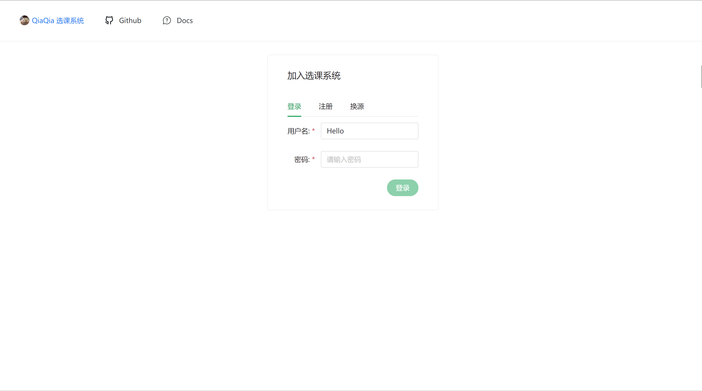
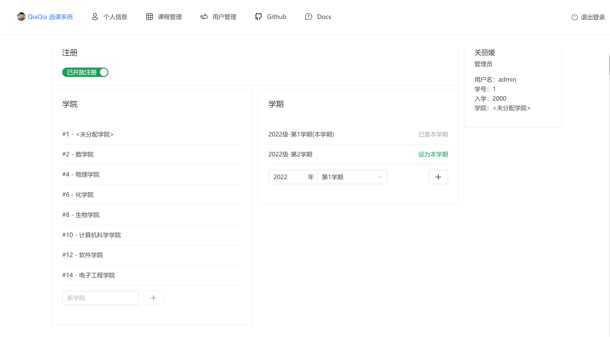
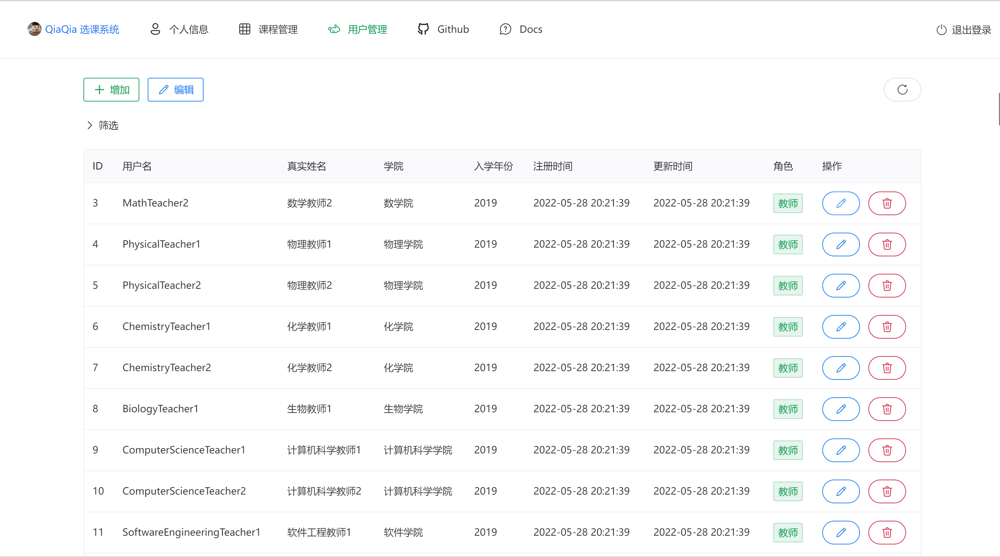

# 测试计划

## 里程碑及进度人员安排

| 里程碑任务     | 工作内容                                                      | 人员安排 | 开始日期   | 结束日期   |
| -------------- | ------------------------------------------------------------- | -------- | ---------- | ---------- |
| 指定测试计划   | 对系统的测试指定详细计划，用于检测系统潜在的问题。            | 全体人员 | 2022-04-20 | 2022-04-25 |
| 设计测试       | 针对系统功能、稳健性、UI/UX、性能等构思测试方法以及测试用例。 | 全体人员 | 2022-04-27 | 2022-05-20 |
| 实施测试       | 对系统按之前的计划安排进行测试。                              | 全体人员 | 2022-05-11 | 2022-06-5  |
| 对测试进行评估 | 汇总测试结果。                                                | 全体人员 | 2022-05-29 | 2022-06-12 |

## 测试环境描述

- 操作系统：Windows10 x64、Ubuntu 20.04 64bit
- RAM：8GB
- CPU：Rayzon R4500H
- 关系型数据库：PostgresQL 14.2
- 键值对数据库：Redis 7.0.2
- Docker: 20.10.14
- Docker-Compose: v2.4.1

## 功能测试用例

注册功能
1. 功能描述：实现用户的注册
2. 用例目的：验证系统的注册功能完整实现
3. 前提条件：通过浏览器打开选课系统

|输入/动作|期望的输出/相应|实际情况|
|---|---|---|
|学号：2019000000000 用户名：Hello 姓名：t 密码：123456 确认密码：123456 学院：数学学院|注册成功，跳转到登陆页面|注册成功，跳转到登陆页面|
|学号：2019000000000 用户名：Hello 姓名：t 密码：123456 确认密码：1234567 学院：数学学院|注册失败|注册失败|

登陆功能
1. 功能描述：实现已注册用户的登陆
2. 用例目的：验证系统的登陆功能完整实现
3. 前提条件：系统里以及注册了一个的用户；去数据库已经存在用户名admin，密码hello-admin

|输入/动作|期望的输出/相应|实际情况|
|---|---|---|
|用户名：Hello 密码 ：123456|登陆成功|登陆成功|
|用户名：Hello 密码：1234567|登陆失败|登陆失败|

选课功能
1. 功能描述：实现选课动作
2. 用例目的：验证系统的选课功能完整实现
3. 前提条件：已经登陆了一个学生用户

|输入/动作|期望的输出/相应|实际情况|
|---|---|---|
|选择尚有余量的且没有冲突的课|选课成功，课程加入到课程表|选课成功，课程加入到课程表|
|选课没有余量的课|选课失败|选课失败|
|选择有时间冲突的课|选课失败|选课失败|

撤课功能
1. 功能描述：实现撤课动作
2. 用例目的：验证系统的撤课功能完整实现
3. 前提条件：学生用户已选好一门课

|输入/动作|期望的输出/相应|实际情况|
|---|---|---|
|选择课程表的一门课进行撤课|撤课成功，课程被撤出课程表|课程被撤出课程表|

添加用户功能
1. 功能描述：添加如学生，老师等用户
2. 用例目的：验证系统的添加用户功能完整实现
3. 前提条件：已登录一名管理员

|输入/动作|期望的输出/相应|实际情况|
|---|---|---|
|添加一名学号：2019000000000 用户名：Hello 姓名：t 密码：123456 确认密码：123456 学院：数学学院 角色：学生的用户|添加成功，用户出现在用户列表里|添加成功，用户出现在用户列表里|
|再添加一名学号：2019000000000 用户名：Hello 姓名：t 密码：123456 确认密码：123456 学院：数学学院 角色：学生的用户|添加失败|添加失败|

删除用户功能
1. 功能描述：删除如学生，老师等用户
2. 用例目的：验证系统的删除用户功能完整实现
3. 前提条件：已登录一名管理员

|输入/动作|期望的输出/相应|实际情况|
|---|---|---|
|删除一名学号：2019000000000 用户名：Hello 姓名：t 密码：123456 确认密码：123456 学院：数学学院 角色：学生的用户|删除成功，用户从用户列表中消失|删除成功，用户从用户列表中消失|

修改用户信息功能
1. 功能描述：修改如学生，老师等用户的信息
2. 用例目的：验证系统的修改用户信息完整实现
3. 前提条件：已登录一名管理员

|输入/动作|期望的输出/相应|实际情况|
|---|---|---|
|修改学号：2019000000000 用户名：Hello 姓名：t 密码：123456 确认密码：123456 学院：数学学院 角色：学生 的用户为学号：2019000000000 用户名：Hello 姓名：t 密码：123456 确认密码：123456 学院：数学学院 角色：老师|修改成功|修改成功|
|修改学号：2019000000000 用户名：Hello 姓名：t 密码：123456 确认密码：123456 学院：数学学院 角色：老师的用户为学号：2019000000000 用户名：Hello 姓名：t 密码：123456 确认密码：1234567 学院：数学学院 角色：老师|修改失败|修改失败|

课程查询功能
1. 功能描述：按照查询条件查询课程信息
2. 用例目的：验证系统的课程查询功能完整实现
3. 前提条件：已登录一名用户

|输入/动作|期望的输出/相应|实际情况|
|---|---|---|
|查询课程名：高等数学 学院：数学院 教师：数学教师1 学期：2022级-第一学期 仅看余量|查询成功，结果里有符合条件的课程|查询成功，结果里有符合条件的课程|
|查询课程名：高等数学 学院：数学院 教师：数学教师2 学期：2022级-第一学期 仅看余量|查询失败，结果里没有符合条件的课程|查询失败，结果里没符合条件的课程|
|查询课程名：高等数学 学院：物理学院 教师：无 学期：2022级-第一学期 仅看余量|查询失败，结果里没有符合条件的课程|查询失败没，结果里有符合条件的课程|
|查询课程名：高等数学 学院：无 教师：无 学期：2022级-第二学期 仅看余量|查询成功，结果里有符合条件的课程|查询成功，结果里有符合条件的课程|
|查询课程名：大学物理 学院：无 教师：无 学期：2022级-第一学期 仅看余量|查询成功，结果里有符合条件的课程|查询成功，结果里有符合条件的课程|
|查询课程名：数据库 学院：无 教师：无 学期：2022级-第一学期 仅看余量|查询失败，结果里没有符合条件的课程|查询成功，结果里没有符合条件的课程|

强制选课功能
1. 功能描述：使学生强制选择某门课程，即使余量已满
2. 用例目的：验证系统的强制选课信息功能完整实现
3. 前提条件：已登录一名管理员

|输入/动作|期望的输出/相应|实际情况|
|---|---|---|
|选择一门余量未满的课程高等数学，输入学生学号2019000000000|该学生强制选上这门课程|该学生强制选上这门课程|
|选择一门余量已满的课程大学物理，输入学生学号2019000000000|该学生强制选上这门课程|该学生强制选上这门课程|

强制撤课功能
1. 功能描述：使学生强制撤销某门课程
2. 用例目的：验证系统的强制撤课信息功能完整实现
3. 前提条件：已登录一名管理员

|输入/动作|期望的输出/相应|实际情况|
|---|---|---|
|选择一门课程高等数学，输入学生学号2019000000000|该学生强制撤除这门课程|该学生强制撤除这门课程|
|选择一门课程大学物理，输入学生学号2019000000000|撤课失败，该学生未选这门课|撤课失败，该学生未选这门课|

## 健壮性测试用例

| 异常输入/动作  | 前端容错能力/恢复能力                                                                                                                                                          | 后端容错能力/恢复能力                                                                                              | 造成的危害、损失 |
| -------------- | ------------------------------------------------------------------------------------------------------------------------------------------------------------------------------ | ------------------------------------------------------------------------------------------------------------------ | ---------------- |
| 错误的数据类型 | 前端使用TypeScript预定义提交的数据类型，并严格封装API，设计范围内不会出现该问题。                                                                                        | 后端会输入数据从JSON进行反序列化，若结构不规范、或类型不正确都会使得反序列化失败，此时后端将给出相应提示请求有误。 | 无               |
| 定义域外的值   | 前端用于输入对应值的UI组件总会将值修正在预期的范围内，同时若出现了无效且无法主动修正的值，UI会随时在输入组件下给出错误提示，并且禁用相关的提交按钮，防止用户尝试提交无效数据。 | 后端引入了表单验证机制，表单中出现预期外的数据会相应错误，并给出错误提示                                           | 无               |
| 错误的操作顺序 | 目前的操作主要都是独立的，所以暂不存在该问题。                                                                                                                                 | 目前的操作主要都是独立的，所以暂不存在该问题。                                                                     | 无               |
| 异常中断通信   | 前端会捕获异常，并给出错误通知。                                                                                                                                               | -                                                                                                                  | 无               |

## 用户界面测试用例

| 检查项                                                 | 测试人员的类别及其评价          |
| ------------------------------------------------------ | ------------------------------- |
| 窗口切换、移动、改变大小时正常吗？                     | Administrative Tester：正常 |
| 各种界面元素的文字正确吗？（如标题、提示等）           |                             Administrative Tester：正确    |
| 各种界面元素的状态正确吗？（如有效、无效、选中等状态） |                              Administrative Tester：正确   |
| 各种界面元素支持键盘操作吗？                           |                              Administrative Tester：支持   |
| 各种界面元素支持鼠标操作吗？                           |                            Administrative Tester：支持     |
| 对话框中的缺省焦点正确吗？                             |                          Administrative Tester：正确       |
| 数据项能正确回显吗？                                   |                                 Administrative Tester：正确|
| 对于常用的功能，用户能否不必阅读手册就能使用？         |                                 Administrative Tester：是|
| 执行有风险的操作时，有“确认”、“放弃”等提示吗？         |                                 Administrative Tester：是|
| 操作顺序合理吗？                                       |                                 Administrative Tester：合理|
| 有联机帮助吗？                                         |                                 Administrative Tester：有|
| 各种界面元素的布局合理吗？美观吗？                     |                                 Administrative Tester：合理且美观|
| 各种界面元素的颜色协调吗？                             |                                 Administrative Tester：协调|
| 各种界面元素的形状美观吗？                             |                                 Administrative Tester：非常美观|
| 字体美观吗？                                           |                                 Administrative Tester：非常美观|
| 图标直观吗？                                           |                                 Administrative Tester：非常直观|
