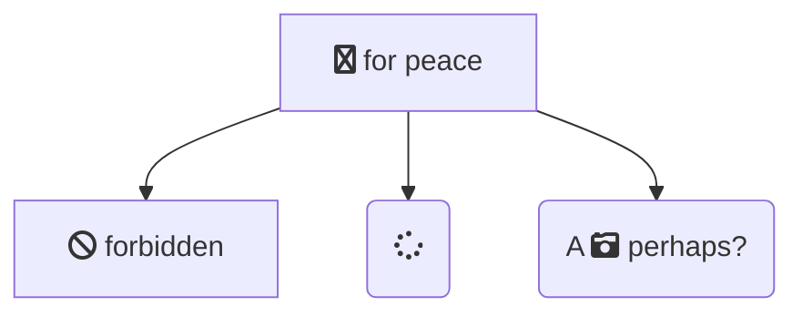
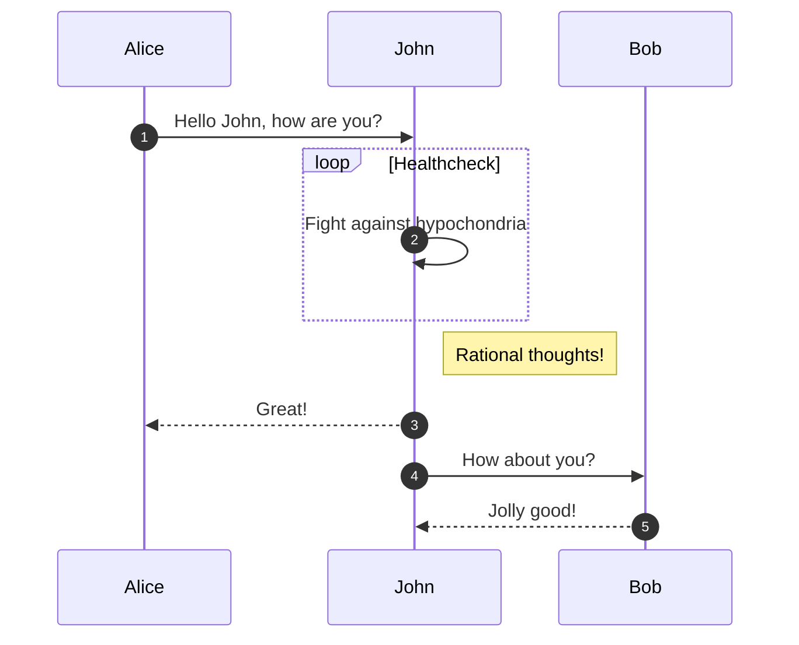
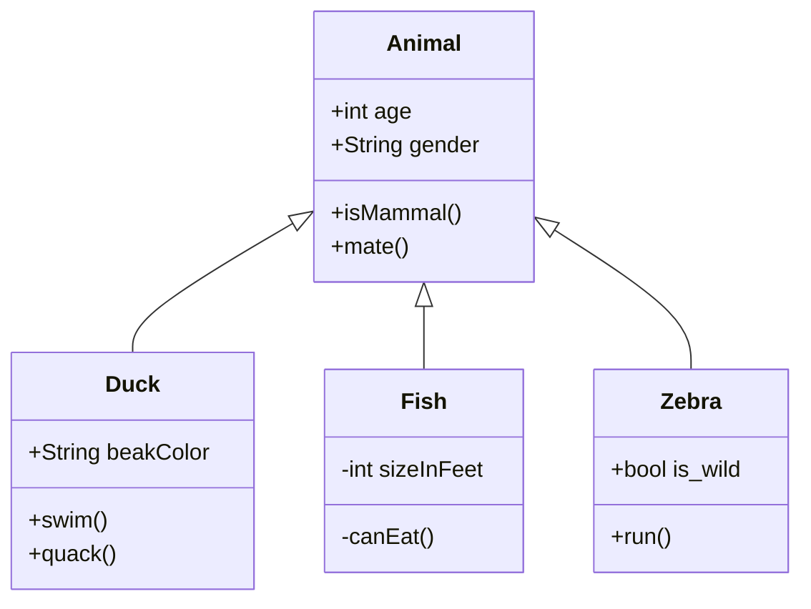
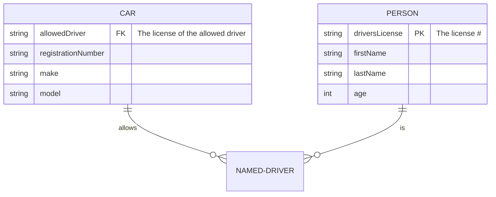
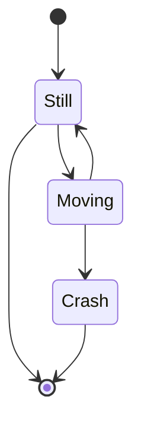
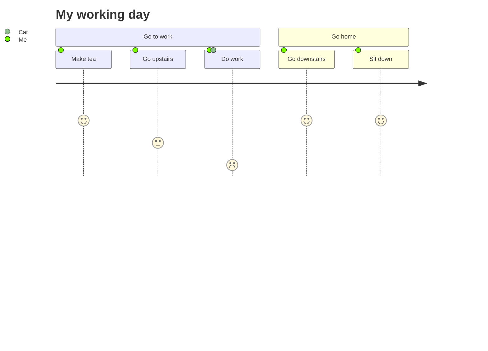
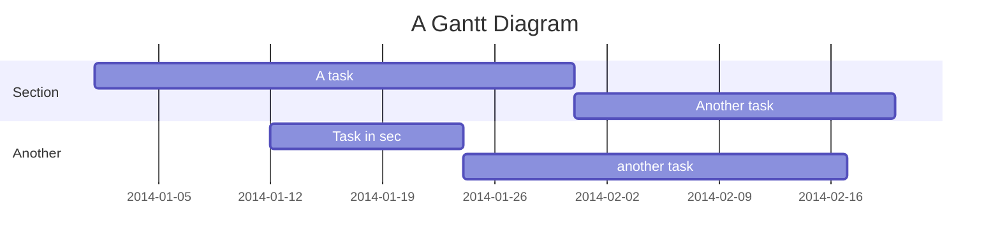
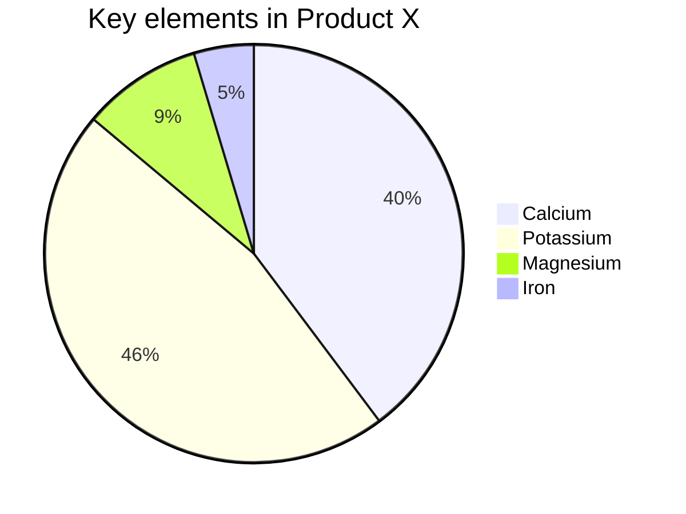
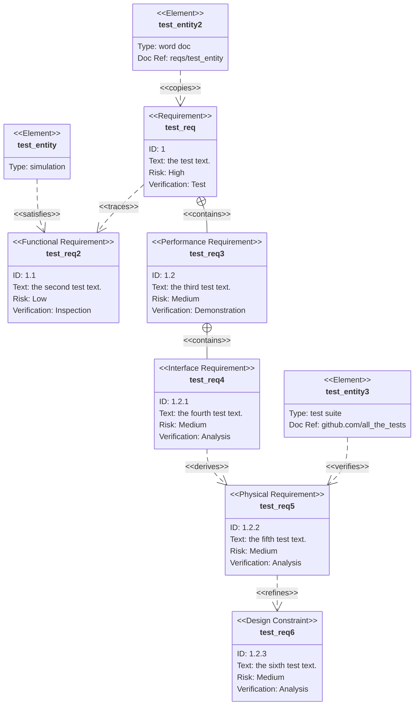

# Mermaid 测试

## 特性

- 自动切换主题：亮色/暗色

## 测试

### 流程图

```mermaid
flowchart TD
    B["fa:fa-twitter for peace"]
    B-->C[fa:fa-ban forbidden]
    B-->D(fa:fa-spinner);
    B-->E(A fa:fa-camera-retro perhaps?)
```

### 时序图

```mermaid
sequenceDiagram
    autonumber
    Alice->>John: Hello John, how are you?
    loop Healthcheck
        John->>John: Fight against hypochondria
    end
    Note right of John: Rational thoughts!
    John-->>Alice: Great!
    John->>Bob: How about you?
    Bob-->>John: Jolly good!
```

### 类图

```mermaid
 classDiagram
      Animal <|-- Duck
      Animal <|-- Fish
      Animal <|-- Zebra
      Animal : +int age
      Animal : +String gender
      Animal: +isMammal()
      Animal: +mate()
      class Duck{
          +String beakColor
          +swim()
          +quack()
      }
      class Fish{
          -int sizeInFeet
          -canEat()
      }
      class Zebra{
          +bool is_wild
          +run()
      }
```

### ER图

```mermaid

erDiagram
    CAR ||--o{ NAMED-DRIVER : allows
    CAR {
        string allowedDriver FK "The license of the allowed driver"
        string registrationNumber
        string make
        string model
    }
    PERSON ||--o{ NAMED-DRIVER : is
    PERSON {
        string driversLicense PK "The license #"
        string firstName
        string lastName
        int age
    }

```

### 状态图

```mermaid
stateDiagram-v2
    [*] --> Still
    Still --> [*]

    Still --> Moving
    Moving --> Still
    Moving --> Crash
    Crash --> [*]
```

### 用户旅程图

```mermaid
journey
    title My working day
    section Go to work
      Make tea: 5: Me
      Go upstairs: 3: Me
      Do work: 1: Me, Cat
    section Go home
      Go downstairs: 5: Me
      Sit down: 5: Me
```

### 甘特图

```mermaid
gantt
    title A Gantt Diagram
    dateFormat  YYYY-MM-DD
    section Section
    A task           :a1, 2014-01-01, 30d
    Another task     :after a1  , 20d
    section Another
    Task in sec      :2014-01-12  , 12d
    another task      : 24d
```

### 饼状图

```mermaid
pie
    title Key elements in Product X
    "Calcium" : 42.96
    "Potassium" : 50.05
    "Magnesium" : 10.01
    "Iron" :  5
```

### 需求图

```mermaid
    requirementDiagram

    requirement test_req {
    id: 1
    text: the test text.
    risk: high
    verifymethod: test
    }

    functionalRequirement test_req2 {
    id: 1.1
    text: the second test text.
    risk: low
    verifymethod: inspection
    }

    performanceRequirement test_req3 {
    id: 1.2
    text: the third test text.
    risk: medium
    verifymethod: demonstration
    }

    interfaceRequirement test_req4 {
    id: 1.2.1
    text: the fourth test text.
    risk: medium
    verifymethod: analysis
    }

    physicalRequirement test_req5 {
    id: 1.2.2
    text: the fifth test text.
    risk: medium
    verifymethod: analysis
    }

    designConstraint test_req6 {
    id: 1.2.3
    text: the sixth test text.
    risk: medium
    verifymethod: analysis
    }

    element test_entity {
    type: simulation
    }

    element test_entity2 {
    type: word doc
    docRef: reqs/test_entity
    }

    element test_entity3 {
    type: "test suite"
    docRef: github.com/all_the_tests
    }


    test_entity - satisfies -> test_req2
    test_req - traces -> test_req2
    test_req - contains -> test_req3
    test_req3 - contains -> test_req4
    test_req4 - derives -> test_req5
    test_req5 - refines -> test_req6
    test_entity3 - verifies -> test_req5
    test_req <- copies - test_entity2
```